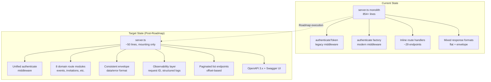

# Design Document: Backend Modernization Roadmap

## Overview

This design defines the structure, content, and organization of the Backend Modernization Roadmap for Stellar Guardian 3.0. The roadmap is a planning artifact that sequences six milestones of backend remediation work identified during a consistency audit. It does not implement any code changes — it provides the authoritative reference document from which future implementation specs will be derived.

The roadmap addresses systemic issues across six domains discovered post-stabilization: inconsistent response formats (29 flat-response endpoints), fragmented error handling (~20 legacy error patterns), dual authentication middleware (`authenticateToken` legacy vs `authenticate` factory), monolithic route file (854+ lines in server.ts with only 3 of ~11 domain modules extracted), absent observability infrastructure, and missing pagination/documentation standards.

### Design Decisions

1. **Single-document format**: The entire roadmap lives in one document rather than separate files per milestone, enabling cross-milestone comparison and dependency visualization in one view.
2. **Mermaid dependency graph**: Dependencies are expressed both as a structured list and as a Mermaid diagram for visual consumption by stakeholders.
3. **Relative effort sizing (T-shirt)**: Since team velocity is unknown, effort is expressed as S/M/L/XL relative to sprint capacity rather than absolute person-days.
4. **Critical path is fully sequential**: All six milestones form a single dependency chain (1→2→3→4→5→6), with one partial-overlap opportunity between Milestones 3 and 4.

## Architecture

The roadmap document itself has no runtime architecture — it is a static planning artifact. However, the architecture it describes (and sequences remediation for) is:



### Document Architecture

The roadmap document follows a hierarchical structure:

```
Roadmap Document
├── Executive Summary
├── Milestone 1: API Contract Standardization
│   ├── Scope (≤200 words)
│   ├── Expected Impact
│   ├── Implementation Risk + Mitigation
│   ├── Estimated Effort
│   ├── Dependencies
│   ├── Execution Order
│   └── Completion Criteria
├── Milestone 2: Authentication & Authorization
│   └── [same structure]
├── Milestone 3: Route Modularization
│   └── [same structure]
├── Milestone 4: Observability
│   └── [same structure]
├── Milestone 5: API Scalability
│   └── [same structure]
├── Milestone 6: Documentation
│   └── [same structure]
├── Dependency Graph (Mermaid + table)
├── Risk & Effort Summary Table
└── Non-Implementation Constraint Statement
```

## Components and Interfaces

Since this is a planning document, "components" refer to the document's structural elements rather than software modules.

### Milestone Entry Component

Each milestone entry is a self-contained section with the following interface:

| Field | Type | Constraints |
|-------|------|-------------|
| Name | string | One of the 6 defined milestone names |
| Execution Order | integer | 1–6, sequential, unique |
| Scope Summary | text | ≤200 words |
| Expected Impact | enum + description | Low / Medium / High with affected-components note |
| Implementation Risk | enum + description | Low / Medium / High per defined criteria |
| Risk Mitigation | text | Strategy to reduce identified risk |
| Estimated Effort | enum | S / M / L / XL (relative sizing) |
| Dependencies | list | References to predecessor milestones by name, or "None" |
| Completion Criteria | list | Verifiable outcomes that define "done" |

### Risk Classification Interface

Risk levels follow strict definitions:
- **Low**: Affects 1–2 modules, no breaking changes to existing consumers
- **Medium**: Affects 3–4 modules, or introduces breaking changes manageable via versioning
- **High**: Affects 5+ modules, or introduces breaking changes requiring all consumers to update

### Effort Sizing Interface

Relative sizing definitions:
- **S**: Completable within a single sprint equivalent
- **M**: 2–3 sprint equivalents
- **L**: 4–6 sprint equivalents
- **XL**: More than 6 sprint equivalents

### Dependency Graph Component

The dependency graph provides:
- A Mermaid diagram showing milestone-to-milestone edges
- A structured table with columns: Predecessor, Successor, Gate Condition
- Identification of the critical path
- Labeling of parallel execution opportunities

### Summary Table Component

Single table with columns:
- Milestone Name
- Execution Order (numeric)
- Impact (Low/Medium/High)
- Risk (Low/Medium/High)
- Estimated Effort (S/M/L/XL)
- Key Dependencies (up to 3, or "None")

Followed by a total-effort indicator line (e.g., "1×S, 2×M, 2×M, 1×L").

## Data Models

The roadmap is a static document with no runtime data persistence. The "data model" below describes the logical schema of the information it contains.

### MilestoneEntry

```typescript
interface MilestoneEntry {
  name: string;               // e.g., "API Contract Standardization"
  executionOrder: 1 | 2 | 3 | 4 | 5 | 6;
  scope: string;              // max 200 words
  expectedImpact: {
    level: 'Low' | 'Medium' | 'High';
    description: string;      // which components affected and how
  };
  implementationRisk: {
    level: 'Low' | 'Medium' | 'High';
    description: string;      // reasoning for classification
    mitigation?: string;      // risk reduction strategy
  };
  estimatedEffort: 'S' | 'M' | 'L' | 'XL';
  dependencies: DependencyEdge[];
  completionCriteria: string[];
}

interface DependencyEdge {
  predecessorMilestone: string;   // name of blocking milestone
  gateCondition: string;          // specific deliverable that unblocks successor
}

interface RoadmapDocument {
  milestones: [MilestoneEntry, MilestoneEntry, MilestoneEntry, MilestoneEntry, MilestoneEntry, MilestoneEntry]; // exactly 6
  dependencyGraph: DependencyEdge[];
  criticalPath: string[];         // ordered milestone names
  parallelOpportunities: ParallelOpportunity[];
  summaryTable: SummaryRow[];
  totalEffortIndicator: string;   // e.g., "1×S, 2×M, 2×L, 1×XL"
}

interface ParallelOpportunity {
  milestone: string;
  parallelWith: string;
  unblockedTasks: string[];
  gateCondition: string;
}

interface SummaryRow {
  milestoneName: string;
  executionOrder: number;
  impact: 'Low' | 'Medium' | 'High';
  risk: 'Low' | 'Medium' | 'High';
  effort: 'S' | 'M' | 'L' | 'XL';
  keyDependencies: string[];   // max 3 items, or ["None"]
}
```

### Milestone Content Mapping (from current codebase analysis)

| Milestone | Current State Evidence | Scope Estimate |
|-----------|----------------------|----------------|
| 1. API Contract | 29 flat `res.json({...})` calls, ~20 `{ error: "string" }` patterns, mixed status codes | 49 endpoints to touch |
| 2. Auth | `authenticateToken` inline in server.ts + `authenticate` factory in middleware/auth.ts, `requireHost` already composable | ~30 protected endpoints |
| 3. Route Modularization | 854+ line server.ts, only auth/notifications/stellar extracted (3 of ~11 domains) | 8 new route modules |
| 4. Observability | Structured logger exists (4 endpoints), no request ID, no health checks | Additive middleware |
| 5. API Scalability | Pagination in notifications only, all other lists return full arrays | ~5 list endpoints |
| 6. Documentation | No OpenAPI spec, no Swagger UI, no architecture diagrams | Full doc generation |

## Error Handling

Not applicable — this is a planning document with no runtime behavior. Error handling patterns for the milestones themselves will be defined in their respective implementation specs.

The roadmap document does specify error-handling standards that future milestones must achieve:
- Milestone 1 defines the target error envelope format: `{ error: { code: string, message: string, details?: object } }`
- Milestone 2 specifies auth error responses must use the standardized envelope from Milestone 1
- Milestone 4 ensures errors are captured in structured logging with request correlation IDs

## Testing Strategy

### PBT Applicability Assessment

Property-based testing is **NOT applicable** to this feature because:

1. **This is a planning document, not executable code** — there are no functions with inputs/outputs to test
2. **No data transformations** — the roadmap is a static artifact with no runtime behavior
3. **No universal properties** — there is no input space to vary; the document either conforms to its structural requirements or it doesn't
4. **Configuration/structure validation** — the acceptance criteria describe document structure constraints, which are best validated by example-based checks (schema validation)

### Appropriate Testing Approach

Since this spec produces a planning document (not code), testing focuses on **document conformance verification**:

**Manual review checklist** (for the roadmap document itself):
- [ ] Document contains exactly 6 milestones with correct names
- [ ] Each milestone has all required fields (scope ≤200 words, impact, risk, effort, dependencies, execution order, completion criteria)
- [ ] Risk classifications match the defined Low/Medium/High criteria
- [ ] Effort sizing uses S/M/L/XL with correct definitions
- [ ] Dependencies are self-consistent (no circular references, no references to non-existent milestones)
- [ ] Execution order is sequential 1–6
- [ ] Critical path matches the dependency graph
- [ ] Summary table matches individual milestone metadata
- [ ] Total-effort indicator counts match
- [ ] Document contains zero code implementations or file modifications
- [ ] Parallel execution opportunities are correctly identified per dependency constraints

**Example-based validation** (if automated):
- Verify Mermaid diagram syntax is parseable
- Verify scope summaries are ≤200 words each
- Verify all dependency edges reference valid milestone names
- Verify summary table row count equals 6
- Verify no code blocks contain implementation code (only illustrative pseudocode if any)

No unit tests, integration tests, or property-based tests are required for this planning-only spec.
