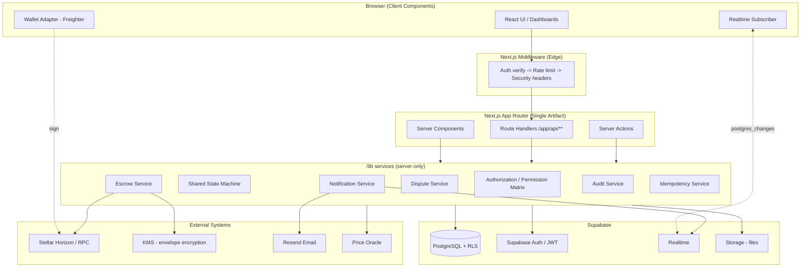
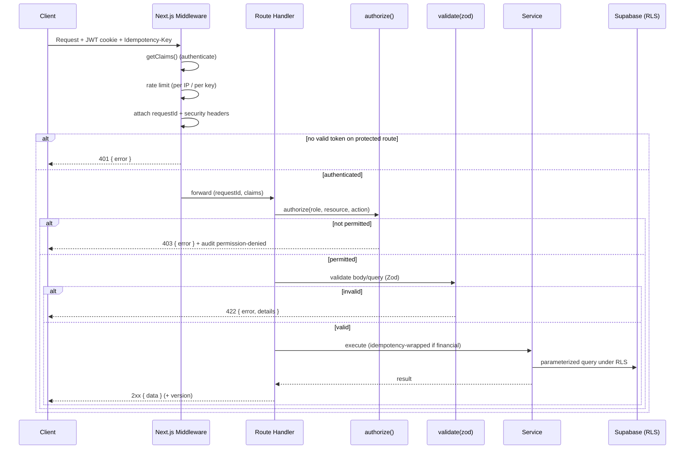
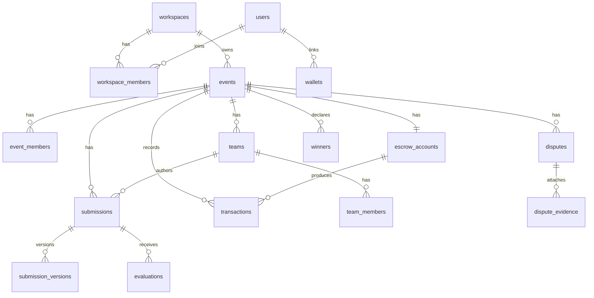

# Design Document

## Overview

This design describes the conversion of Stellar Guardian from a React 19 + Vite SPA with a monolithic Express 4 backend (`server.ts`, `better-sqlite3`, Firebase/Firestore sync) into a production-grade **Next.js App Router** full-stack application backed by **PostgreSQL via Supabase**. The conversion resolves the 19+ critical/high-severity production readiness issues captured in the requirements — broken organizer-funded escrow, missing wallet-ownership verification, security gaps, absent dispute windows, incomplete team formation, non-idempotent financial operations, and architectural debt (duplicate state machines, a "god" event endpoint, duplicate Stellar SDK versions, dead integrations).

The target architecture is a single deployable Next.js artifact. Server Components fetch data directly; Route Handlers (`/app/api/**`) replace every Express route; Next.js middleware performs authentication, rate limiting, and security headers. All persistent state lives in Supabase Postgres with Row Level Security (RLS) as a second enforcement layer beneath API-level authorization. Blockchain custody follows an **organizer-funded** model: the platform generates a per-event escrow keypair, stores the secret key under KMS-backed envelope encryption, and the organizer's own **verified** wallet is always the funding source. The platform acts as custodian only for signing disbursement and refund transactions from the escrow account.

### Design Goals

1. **Correctness of money movement** — funding, disbursement, and refunds are verified on-chain, idempotent, and reconciled against database state at every escrow transition.
2. **Single source of truth** — one Zod-derived type system, one shared state machine module, one Stellar SDK (`@stellar/stellar-sdk` v16+), one permission matrix.
3. **Defense in depth** — authorization enforced at API middleware *and* database RLS; secrets never in client bundles; all inputs validated with Zod.
4. **Trust and transparency** — public on-chain verification endpoint, immutable append-only audit records, dispute/objection window before irreversible disbursement.
5. **Extensibility** — adapter interfaces (wallet, chain), plugin hooks, versioned public API, and per-workspace feature flags for future growth without core refactoring.

### Key Design Decisions

| Decision | Rationale |
| --- | --- |
| Next.js App Router with Server Components by default | Unified full-stack artifact (Req 1.7); minimizes client bundle; SSR for data pages |
| `@supabase/ssr` `createServerClient`/`createBrowserClient` | Correct cookie-based session propagation across Server Components, Route Handlers, and middleware (verified via Context7 Supabase docs) |
| Two Supabase clients: RLS-scoped (user JWT) and service-role | User-scoped client enforces RLS for reads/user writes; service-role client used only inside audited server services for privileged, transactional operations |
| Shared state machine as a pure TypeScript module | Eliminates duplicate `VALID_TRANSITIONS` (server.ts) and `src/lib/eventStatus.ts` (Req 6.5, 23.10); importable server + client |
| Organizer-funded escrow, platform-custodied distribution | Satisfies cryptographic trust (Req 4.1) while enabling automated disbursement/refund (Req 4.9, 8.3) |
| Claimable balances + batched transactions for disbursement | Stellar caps operations at 100 per transaction; batching-with-reconciliation preserves all-or-nothing intent (Req 8.6 design note) |
| Idempotency via DB unique constraint + stored response | Prevents double-spend under retries/races at the database layer (Req 13.5) |
| Optimistic concurrency via version column | Detects concurrent edits without pessimistic locks (Req 19) |

### Research Findings (Context7)

- **Supabase / `@supabase/ssr`**: The canonical Next.js integration creates a browser client (`createBrowserClient`) for Client Components and a server client (`createServerClient`) wired to `next/headers` cookies for Server Components, Route Handlers, and middleware. Middleware MUST call `supabase.auth.getClaims()` immediately after creating the server client — inserting code between the two, or removing the call, causes intermittent SSR logouts. RLS policies use `auth.uid()` (wrapped as `(select auth.uid())` for planner caching). Realtime uses `.channel(...).on('postgres_changes', { event, schema, table }, cb).subscribe()`, and tables must be added to the `supabase_realtime` publication.
- **`@stellar/stellar-sdk` v16+**: `Keypair.verify(data: Buffer, signature: Buffer): boolean` verifies a challenge signature against a public key. `TransactionBuilder` chains multiple `Operation.payment(...)` operations; fee is `baseFee * operationCount`; `.setTimeout(n).build()` then `tx.sign(keypair)`; submission via `horizon.submitTransaction(tx)` returns `{ hash, successful }`. Claimable balances (`Operation.createClaimableBalance` / `claimClaimableBalance`, `transaction.getClaimableBalanceId(opIndex)`) provide a mechanism to hold a winner's allocation when they have no verified wallet at disbursement time.
- **Resend**: emails are sent server-side via `resend.emails.send({ from, to, subject, react|html })`; used only from server services to keep the API key out of client bundles.

---

## Architecture

### High-Level System Architecture



### Request Pipeline (Middleware Composition Order)

Every protected request flows through a fixed pipeline (Req 3.4): **authenticate → authorize → validate → handle**. Middleware handles cross-cutting concerns; per-route composition handles resource-specific concerns.



### Layered Architecture

- **`/app`** — routes, pages (Server Components), and `/app/api/**` Route Handlers. Public API namespaced under `/app/api/v1/**` (Req 32.2).
- **`/components`** — reusable Client/Server UI; role-specific dashboards; wallet UI; data tables that collapse to cards on mobile.
- **`/lib`** — server-only services (escrow, dispute, notification, audit, idempotency, authorization), the Supabase client factories, the shared state machine, the wallet/chain adapters, and the Stellar client.
- **`/types`** — Zod schemas as the single source of truth (Req 1.5); TypeScript types are inferred via `z.infer`. DB row types, API request/response types, and component props all derive from here.

### Concurrency, Real-Time, and Degradation Strategy

Per the Requirement 2.6-vs-2.5/28.2 design note, failure modes are separated:

- **Critical categories** (require the core data store to be reachable): escrow/funding state, disbursement, dispute state transitions, winner finalization, auth. If Postgres is unreachable, endpoints return **503** with a structured error (Req 2.6, 20.4).
- **Non-critical categories** (eligible for degraded polling if only the realtime channel is down but Postgres is reachable): routine team activity, milestone reminders, activity-timeline refresh, notification badge counts. The client falls back to **polling at a 15-second interval** (Req 2.8) rather than surfacing an error.
- **Realtime delivery target**: notifications delivered within 5 seconds via `postgres_changes` subscriptions (Req 28.2).

### Deployment & Environments

- Single Next.js deployable artifact; no separate backend process (Req 1.7).
- Three isolated environments (development, staging, production) with no shared secrets or datastores (Req 38.4).
- Secrets in a secrets manager with rotation-without-downtime; no committed config files; previously committed secrets (e.g., `firebase-applet-config.json`) removed (Req 38.1, 38.5, 14.4).
- CI gates on type-check, lint, test, and migration dry-run before merge to main (Req 38.2).
- Supabase Postgres DR targets: RPO 15 min, RTO 4 h, verified by periodic restore drills (Req 38.3).
---

## Components and Interfaces

### Directory Structure (Req 1.6)

```
/app
  /(public)/discover           # public event discovery + search (Req 37)
  /(auth)/login, /signup       # Supabase Auth flows (Req 3)
  /(app)/dashboard             # role-specific dashboards (Req 29)
  /(app)/workspaces/[slug]/... # workspace-scoped routes (Req 24)
  /(app)/events/[id]/...       # event detail + sub-resources
  /api
    /health                    # health + readiness (Req 20)
    /auth/wallet/challenge     # wallet challenge issue (Req 5)
    /auth/wallet/verify        # challenge-response verify (Req 5)
    /events/[id]/...           # focused sub-resources (Req 12)
    /events/[id]/fund          # financial (idempotent) (Req 4, 13)
    /events/[id]/disburse      # financial (idempotent) (Req 8, 13)
    /events/[id]/refund        # financial (idempotent) (Req 9, 13)
    /events/[id]/verify-escrow # public on-chain verification (Req 4.6)
    /disputes/...              # dispute lifecycle (Req 39)
    /v1/...                    # versioned public API (Req 32.2)
/components                    # UI (dashboards, wallet, tables, states)
/lib
  /supabase                    # server + browser client factories
  /state-machine               # shared event + escrow + dispute machines
  /services                    # escrow, dispute, notification, audit, idempotency, permission
  /stellar                     # chain adapter + Stellar client
  /wallet                      # Wallet_Adapter interface + Freighter adapter
  /validation                  # zod schemas re-exported from /types
/types                         # zod schemas = single source of truth (Req 1.5)
/supabase/migrations           # Supabase CLI migrations (Req 2.4)
```

### Supabase Client Factories (`/lib/supabase`)

Two factories, per Context7 Supabase guidance:

- `createBrowserClient()` — Client Components; uses the publishable (anon) key; all queries subject to RLS.
- `createServerClient()` — Server Components, Route Handlers, middleware; wired to `next/headers` cookies; carries the user JWT so RLS applies.
- `createServiceClient()` — server-only privileged client (service-role key), used **exclusively** inside audited services for transactional/privileged operations (e.g., writing audit records, escrow state transitions). Never imported into client code.

Middleware calls `supabase.auth.getClaims()` immediately after `createServerClient()` (no intervening code) to keep SSR sessions stable.

### Shared State Machine Module (`/lib/state-machine`) — Req 6, 23

A single pure module exporting the canonical event lifecycle, escrow lifecycle, and dispute lifecycle, importable by both server and client. No I/O; pure functions over `(currentState, requestedState, context)`.

```typescript
// Canonical event states (Req 23.1) — single source of truth
export type EventState =
  | 'Draft' | 'Published' | 'RegistrationOpen' | 'RegistrationClosed'
  | 'TeamFormation' | 'SubmissionOpen' | 'SubmissionClosed' | 'Judging'
  | 'ReviewObjectionWindow' | 'WinnersFinalized' | 'OrganizerFundsEscrow'
  | 'EscrowLocked' | 'PrizeDistribution' | 'Completed' | 'Cancelled' | 'Archived';

export const TERMINAL_STATES: ReadonlySet<EventState>;   // Completed, Cancelled, Archived
export const ROLLBACK_TRANSITIONS: ReadonlyMap<EventState, EventState[]>; // Req 23.6

export interface TransitionContext {
  judgeCount: number; registrationDeadline?: string; teamSizeMin?: number;
  hasSubmissions: boolean; allSubmissionsScored: boolean;
  escrowFullyFundedOnChain: boolean; reviewWindowElapsed: boolean;
  unresolvedDisputes: number; registrationCount: number; submissionCount: number;
  actorRole: PlatformRole;
}

export interface TransitionResult {
  ok: boolean;
  validOutbound: EventState[];        // for 422 payloads (Req 23.5)
  unmetPreconditions: string[];       // for 422 payloads (Req 23.5)
}

export function canTransition(from: EventState, to: EventState, ctx: TransitionContext): TransitionResult;
export function validOutboundStates(from: EventState, ctx: TransitionContext): EventState[];
export function isTerminal(s: EventState): boolean;

// Escrow lifecycle (Req 26.1)
export type EscrowState =
  | 'PendingFunding' | 'PartiallyFunded' | 'FullyFunded' | 'Locked'
  | 'PendingRelease' | 'Released' | 'Refunded' | 'Failed' | 'Cancelled';
export function canEscrowTransition(from: EscrowState, to: EscrowState, ctx: EscrowContext): TransitionResult;

// Dispute lifecycle (Req 39.1)
export type DisputeState = 'Open' | 'UnderReview' | 'Upheld' | 'Dismissed' | 'Withdrawn';
export const DISPUTE_TERMINAL: ReadonlySet<DisputeState>; // Upheld, Dismissed, Withdrawn
export function canDisputeTransition(from: DisputeState, to: DisputeState, actorRole: PlatformRole, isFiler: boolean): TransitionResult;
```

The transition map encodes preconditions from Req 23.3 (e.g., `Published` requires `judgeCount >= 1`; `EscrowLocked` requires `escrowFullyFundedOnChain`; `PrizeDistribution` requires `EscrowLocked && reviewWindowElapsed && unresolvedDisputes === 0`) and blocks `PrizeDistribution` while any dispute is Open/UnderReview (Req 39.7). Route handlers call `canTransition` before any DB write; on failure they return 422 with `{ currentState, requestedState, validOutbound, unmetPreconditions }` (Req 6.4, 23.5).

### Authorization & Permission Matrix (`/lib/services/permission`) — Req 27, 3.7

A single declarative matrix maps `PlatformRole × ResourceCategory × Action → boolean`, enforced at **both** API middleware and Supabase RLS (Req 27.10).

```typescript
export type PlatformRole =
  | 'PlatformAdmin' | 'WorkspaceOwner' | 'WorkspaceAdmin' | 'Organizer'
  | 'Sponsor' | 'Judge' | 'Mentor' | 'Participant' | 'TeamCaptain' | 'TeamMember';

export type ResourceCategory =
  | 'Events' | 'Submissions' | 'Evaluations' | 'Teams' | 'EscrowFunding'
  | 'Disbursements' | 'Workspaces' | 'Members' | 'Invitations' | 'Sponsors'
  | 'Milestones' | 'Disputes' | 'Notifications';

export type Action = 'read' | 'create' | 'update' | 'delete' | 'approve' | 'reject';

export function can(role: PlatformRole, resource: ResourceCategory, action: Action, scope: Scope): boolean;
// authorize() middleware wraps can(); denials return 403 and log an audit permission-denied record (Req 27.11, 39.10)
export function authorize(ctx: AuthContext, resource: ResourceCategory, action: Action): Result<void, ForbiddenError>;
```

The single `authorize()`/`requireOrganizer()` helper replaces the 15+ copy-pasted inline organizer checks (Req 3.7). RLS policies mirror the matrix so unauthorized rows are invisible even if an API check is bypassed.

### Wallet Adapter & Verifier (`/lib/wallet`) — Req 5, 25, 33

```typescript
export interface WalletAdapter {                 // Req 25.1, 33.2
  readonly provider: 'Freighter' | 'Albedo' | 'xBull' | 'Rabet';
  isAvailable(): Promise<boolean>;
  connect(): Promise<{ publicKey: string; network: NetworkMode }>;
  disconnect(): Promise<void>;
  getPublicKey(): Promise<string>;
  getNetwork(): Promise<NetworkMode>;
  signTransaction(xdr: string, network: NetworkMode): Promise<string>; // signed XDR
  signMessage(message: string): Promise<string>;                       // signed challenge
}

export type WalletConnectionState =
  | 'Disconnected' | 'Connecting' | 'Connected' | 'Verified' | 'Error'; // Req 33.4
```

Freighter is the primary adapter (Req 33.1); the registry exposes extension points for additional providers without changing consumers (Req 25.2). The server-side **Wallet Verifier** implements challenge-response (Req 5):

1. `POST /api/auth/wallet/challenge` → generate a random 32-byte nonce, store server-side with 5-minute expiry keyed to user + claimed address.
2. Client signs the nonce with `signMessage`.
3. `POST /api/auth/wallet/verify` → server checks nonce freshness, then `Keypair.fromPublicKey(addr).verify(Buffer(nonce), Buffer(signature))`. On success, persist the address marked `verified`; on failure return 400; on expiry require a fresh challenge.

Wallet association is stored at the **account** level (Req 33.15), so multi-device login re-runs challenge-response but references the known verified address. Changing wallets requires a fresh challenge-response for the new address (Req 5.7, 25.4).

### Chain Adapter & Stellar Client (`/lib/stellar`) — Req 4, 8, 9, 26, 32.5

```typescript
export interface ChainAdapter {                  // Req 32.5 (future multi-chain)
  verifySignature(publicKey: string, data: Buffer, signature: Buffer): boolean;
  getBalance(account: string): Promise<string>;
  submitSignedTx(signedXdr: string): Promise<{ hash: string; successful: boolean }>;
  getTransaction(hash: string): Promise<TxStatus | null>;
  buildPaymentBatch(source: string, payments: Payment[]): Promise<string /* unsigned XDR */>;
  explorerUrl(hash: string): string;
}
```

The Stellar implementation uses `@stellar/stellar-sdk` v16+ exclusively (Req 4.7, 17.4). Network mode (testnet/mainnet) is configuration-driven and prevents cross-network submissions (Req 25.5). Mainnet financial operations are disabled until explicitly enabled per environment (Req 34.3).

### Escrow Service (`/lib/services/escrow`) — Req 4, 8, 9, 26

Owns escrow keypair generation (store only public key; secret key encrypted via KMS envelope encryption — Req 4.2), funding verification, disbursement, refund, and reconciliation. All state changes go through `canEscrowTransition` and write an audit record with on-chain balance (Req 26.6).

- **Funding (Req 4.1-4.5)**: organizer signs the funding tx with their verified wallet; the platform private key is never the source. Server verifies the tx on-chain (within a 5-minute window) before recording the on-chain hash as canonical and advancing escrow state. If a Workspace Owner funds on behalf of an Organizer, the signing wallet is the Workspace Owner's verified wallet and both parties are recorded (Req 4.8).
- **Disbursement (Req 8, 8.6 note)**: validate `sum(prizes) <= confirmedOnChainBalance` (Req 8.1). Build payment operations from the escrow account to each winner's verified wallet. Because Stellar caps operations at 100 per transaction, disbursement to >100 winners is split into batches; each batch is all-or-nothing, and a reconciliation record tracks which batches committed so a partially completed disbursement can be detected and either completed or reversed. Winners without a verified wallet at disbursement are skipped, their allocation held (optionally via a claimable balance), and the organizer notified (Req 8.5).
- **Refund (Req 9)**: on cancellation of a funded event, refund the full remaining balance to the wallet that signed the original funding tx (Req 9.1, 4.8); verify on-chain; retry up to 3 times with exponential backoff; on final failure alert organizer + admins with the escrow public key (Req 9.4-9.5). Partial refunds compute remaining balance after completed disbursements (Req 26.10).
- **Reconciliation (Req 26.5, 26.7)**: at every transition, compare on-chain balance to DB record; on mismatch flag `inconsistent`, notify admin + organizer, and block further automated transitions.

### Dispute Service (`/lib/services/dispute`) — Req 7, 39

Creates disputes in `Open` during the Review (Objection Window) for accepted participants (Req 7.3, 39.2); enforces role-gated transitions via `canDisputeTransition` (filer may Withdraw; Organizer/Admin may move Open→UnderReview and Open/UnderReview→Upheld/Dismissed — Req 39.3-39.4); records every transition in an audit record (Req 39.5); blocks event progression to Prize Distribution while any dispute is Open/UnderReview (Req 39.7). Upheld disputes require winner/prize re-evaluation before proceeding (Req 39.8).

### Idempotency Service (`/lib/services/idempotency`) — Req 13

Wraps all financial endpoints. Requires an `Idempotency-Key` header; inserts a row under a **DB unique constraint** on the key before executing (Req 13.5). If the key exists with the same request-body hash, returns the stored response without re-executing (Req 13.2); if the key exists with a different body hash, returns 409 (Req 13.4). Records carry a 24-hour TTL (Req 13.3).

### Notification, Audit & Activity Services — Req 16, 28, 31

- **Notification**: writes in-app notifications, delivers via Supabase realtime (≤5s, Req 28.2), and sends email via Resend for high-priority categories (Req 16.2, 28.5). Honors per-category preferences (Req 16.3/28.6); batches non-urgent items into an hourly digest while urgent categories (disputes, disbursement, security) deliver immediately (Req 16.6).
- **Audit**: append-only writes only; no update/delete path exists in code, and DB triggers + RLS reject modification (Req 28.4, 31.3, 31.8). Financial audit records include tx hash, wallet, amount, on-chain confirmation status (Req 28.7, 31.6). Supports filtered, paginated queries and CSV/JSON export (Req 31.4-31.5). 7-year retention (Req 31.7).
- **Activity Timeline**: derived chronological feed per event (Req 28.3).

### API Response Envelope & Pagination — Req 12, 18

All handlers return `{ data }` (single), `{ data: [...], meta: { cursor, hasMore, total } }` (collections), or `{ error: { code, message, details? } }`. List endpoints use cursor-based pagination (default 20, max 50) with Zod-validated filter/sort params (Req 12.1-12.2, 12.5). The god endpoint `GET /api/events/:id` is split into focused sub-resources, each independently authorized per the permission matrix (Req 12.3-12.4, 12.6).
---

## Data Models

All schemas are defined once as **Zod schemas in `/types`** and TypeScript types are derived via `z.infer` (Req 1.5). Database tables mirror these schemas with foreign keys, indexes on frequently queried columns, and CHECK constraints for enumerated values (Req 2.2). All timestamps are `timestamptz` in UTC (Req 2.7). Every table has RLS enabled (Req 2.3). Mutable resources carry a `version` integer for optimistic concurrency (Req 19).

### Entity Relationship Overview



### Core Tables

**users** (extends Supabase `auth.users`)
- `id uuid PK → auth.users`, `display_name`, `email`, `deactivated_at timestamptz?`, `terms_accepted_version`, `terms_accepted_at` (Req 34.1), `created_at`
- RLS: users read/update own profile; public profile fields readable by others.

**wallets** — Req 5, 25, 33.15
- `id uuid PK`, `user_id FK`, `public_key text`, `provider text`, `verification_status text CHECK IN ('Unverified','Pending','Verified')`, `verified_at timestamptz?`, `network_mode text CHECK IN ('testnet','mainnet')`
- Unique `(user_id, public_key)`; association at account level. Only stored/promoted to `Verified` after successful challenge-response (Req 5.6).

**wallet_challenges** — Req 5.1, 5.5
- `id uuid PK`, `user_id FK`, `claimed_public_key text`, `nonce bytea` (32 bytes), `expires_at timestamptz` (issued_at + 5 min), `consumed_at timestamptz?`

**workspaces** — Req 24
- `id uuid PK`, `slug text UNIQUE` (Req 24.10), `name`, `description`, `logo_url`, `settings jsonb` (timezone, defaults), `billing jsonb` (email, method_ref, plan default 'free' — Req 24.9), `white_label jsonb` (domain, logo, colors, sender — Req 32.8), `feature_flags jsonb` (Req 32.10), `version int`, `created_at`

**workspace_members** — Req 24.3
- `workspace_id FK`, `user_id FK`, `role text CHECK IN ('Owner','Admin','Member')`, PK `(workspace_id, user_id)`; exactly one `Owner` per workspace enforced by partial unique index.

**events** — Req 12, 23
- `id uuid PK`, `workspace_id FK` (Req 24.6), `organizer_id FK`, `title`, `description`, `tags text[]`, `category`, `format`, `state text CHECK IN (<16 canonical states>)` (Req 23.1), `review_window_hours int CHECK BETWEEN 24 AND 168 DEFAULT 72` (Req 7.2), `team_size_min int`, `team_size_max int`, `registration_deadline timestamptz?`, `prize_pool_target numeric`, `network_mode text`, `resubmission_policy jsonb` (Req 30.3), `file_policy jsonb` (Req 30.4), `retention_days int DEFAULT 90` (Req 23.8), `version int`, `created_at`, `updated_at`
- Indexes on `workspace_id`, `state`, `registration_deadline`; GIN index on `to_tsvector(title||description||tags)` for full-text search (Req 37.1).

**event_members** — Req 3.3, 11.3
- `event_id FK`, `user_id FK`, `role text CHECK IN ('Organizer','Judge','Participant','Sponsor','Mentor')`, `status text` (e.g., accepted), PK `(event_id, user_id, role)`; DB constraint prevents a user holding both `Judge` and `Participant` on the same event (Req 11.3).

**escrow_accounts** — Req 4, 26
- `id uuid PK`, `event_id FK UNIQUE`, `stellar_public_key text` (only public key stored — Req 4.2), `encrypted_secret_key bytea` (KMS envelope), `state text CHECK IN (<9 escrow states>)` (Req 26.1), `expected_balance numeric`, `last_reconciled_balance numeric`, `last_reconciled_block bigint`, `funding_wallet text?` (signer/refund destination — Req 4.8), `inconsistent boolean DEFAULT false` (Req 26.7), `version int`
- Secret key never leaves the server; never in any read API.

**transactions** — Req 4.4, 9.3, 25.7
- `id uuid PK`, `event_id FK`, `escrow_id FK?`, `type text CHECK IN ('fund','disbursement','refund','escrow_op')`, `tx_hash text` (canonical on-chain hash — Req 4.4), `amount numeric`, `from_address`, `to_address`, `status text CHECK IN ('pending','confirmed','failed')`, `network_mode`, `created_at`
- Index on `event_id`, `tx_hash UNIQUE`.

**teams / team_members** — Req 10
- `teams`: `id PK`, `event_id FK`, `name`, `captain_id FK`, `version int`. `team_members`: `(team_id, user_id)` PK, `joined_at`. Constraints: team size ≤ `team_size_max` (enforced in service + check); a participant belongs to at most one team per event (partial unique index on `(event_id, user_id)` — Req 10.7).

**submissions / submission_versions** — Req 15, 30
- `submissions`: `id PK`, `event_id FK`, `team_id FK?`, `submitter_id FK`, `status text CHECK IN ('Draft','Submitted')`, `current_version int`, `version int (concurrency)`, `updated_at`. `submission_versions`: `id PK`, `submission_id FK`, `version_no int`, `content jsonb`, `diff_summary jsonb` (Req 30.8), `actor_id`, `created_at` — append-only history (Req 30.2).
- `submission_files`: `id PK`, `submission_id FK`, `storage_path`, `mime_type`, `size_bytes`, `sanitized_filename`.

**evaluations** — Req 11
- `id PK`, `submission_id FK`, `judge_id FK`, `scores jsonb`, `conflict_of_interest boolean DEFAULT false` (Req 11.4), `created_at`. Unique `(submission_id, judge_id)`.

**winners** — Req 8
- `id PK`, `event_id FK`, `recipient_id FK`, `team_id FK?`, `prize_amount numeric`, `disbursement_tx_hash text?` (Req 8.4), `status text CHECK IN ('pending','disbursed','held','skipped')`, `version int`.

**disputes / dispute_evidence** — Req 7, 39, 30.6
- `disputes`: `id PK`, `event_id FK`, `filer_id FK`, `state text CHECK IN ('Open','UnderReview','Upheld','Dismissed','Withdrawn')`, `reason text`, `created_at`, `resolved_at?`, `version int`. `dispute_evidence`: `id PK`, `dispute_id FK`, `storage_path`, `mime_type`, `size_bytes`.

**idempotency_keys** — Req 13
- `key text PK`, `endpoint text`, `request_hash text`, `response_payload jsonb`, `status_code int`, `expires_at timestamptz` (created_at + 24h). Unique constraint on `key` prevents concurrent duplicates (Req 13.5).

**audit_records** — Req 28, 31 (append-only)
- `id PK`, `actor_id`, `actor_name`, `occurred_at timestamptz(3)`, `action_type text`, `target_type text`, `target_id`, `wallet_address text?`, `tx_hash text?`, `before_state jsonb`, `after_state jsonb`, `reason text?`, `request_meta jsonb` (ip, user_agent, request_id), `onchain_status text?`
- No UPDATE/DELETE grants to any role; BEFORE UPDATE/DELETE triggers RAISE EXCEPTION; RLS forbids modification (Req 31.3, 31.8). Indexed on `actor_id`, `action_type`, `target_id`, `occurred_at`.

**notifications / notification_preferences** — Req 16, 28
- `notifications`: `id PK`, `user_id FK`, `category text`, `payload jsonb`, `read_at timestamptz?`, `priority text`, `created_at`. Added to `supabase_realtime` publication for realtime delivery. `notification_preferences`: `(user_id, category)` PK, `email_enabled boolean`.

**sponsors / milestones** — Req 21
- `sponsors`: `id PK`, `event_id FK`, `name`, `logo_url`, `tier text CHECK IN ('Gold','Silver','Bronze')`. `milestones`: `id PK`, `event_id FK`, `title`, `date timestamptz`, `description`.

**invitations** — Req 10.3, 24.4
- `id PK`, `scope text CHECK IN ('workspace','team')`, `scope_id`, `inviter_id`, `invitee_email`, `token text UNIQUE`, `expires_at` (workspace: 7 days), `accepted_at?`.

**legal_acceptances** — Req 34
- `id PK`, `user_id FK`, `document_type text`, `document_version text`, `accepted_at timestamptz`. Re-acceptance required before next financial action after document update (Req 34.5).

### Migrations, RLS, and Realtime

- All schema changes via Supabase CLI migrations with up/down support (Req 2.4).
- Every table enables RLS; policies use `(select auth.uid())` and helper SQL functions mirroring the permission matrix (Req 2.3, 27.10). Audit and escrow-secret data have deny-by-default modification policies.
- Realtime publication (`supabase_realtime`) includes `notifications`, `events` (state changes), and `teams` (Req 2.5, 28.2). If the realtime channel is down but Postgres is reachable, non-critical categories fall back to 15s client polling (Req 2.8).
---

## Correctness Properties

*A property is a characteristic or behavior that should hold true across all valid executions of a system — essentially, a formal statement about what the system should do. Properties serve as the bridge between human-readable specifications and machine-verifiable correctness guarantees.*

The following properties were derived from the acceptance-criteria prework and consolidated to remove redundancy. Each is universally quantified and intended for property-based testing (minimum 100 iterations per test). Infrastructure/config criteria (Supabase wiring, RLS deployment, CSP/HSTS/CORS headers, secrets management, dependency removal, WCAG, UI copy) are covered by integration/smoke/example tests in the Testing Strategy rather than properties.

### State Machine

### Property 1: Transitions occur only when valid and preconditions are met

*For all* pairs of event states `(from, to)` and any transition context, a state change is applied (and the database written) **if and only if** `canTransition(from, to, ctx)` returns `ok`, with all Requirement 23.3 preconditions satisfied; when it returns not-ok, no database modification occurs.

**Validates: Requirements 6.3, 23.2, 23.3**

### Property 2: Invalid transitions return a complete 422 payload

*For all* rejected transition requests, the response is HTTP 422 and includes the current state, the requested state, the list of valid outbound states from the current state, and any unmet preconditions.

**Validates: Requirements 6.4, 23.5**

### Property 3: Outbound transitions are role-gated

*For all* event states and all platform roles, a role can trigger an outbound transition **only if** the permission set for that state grants it; otherwise the transition is rejected with 403.

**Validates: Requirements 23.4**

### Property 4: Terminal and rollback invariants hold

*For all* event states: `Cancelled` is reachable from every non-terminal state; terminal states (`Completed`, `Cancelled`, `Archived`) have no outbound transitions except `Completed → Archived`; and each rollback transition (`Published→Draft`, `RegistrationOpen→Published`, `SubmissionOpen→TeamFormation`) is permitted **only when** its guard holds (respectively: always, zero registrations, zero submissions).

**Validates: Requirements 23.6, 23.7**

### Wallet & Signature Verification

### Property 5: Challenge signature verification round-trip

*For all* Stellar keypairs and challenge nonces, verifying a signature produced by a keypair's secret key against its public key returns true, and verifying any signature produced by a different keypair (or a tampered nonce) returns false and yields a 400 rejection.

**Validates: Requirements 5.2, 5.3, 5.4, 25.9**

### Property 6: Expired challenges are rejected

*For all* challenge nonces, a verification attempt submitted more than 5 minutes after issuance is rejected and a fresh challenge is required.

**Validates: Requirements 5.1, 5.5**

### Property 7: Wallets are Verified only via completed challenge-response

*For all* wallet records, `verification_status = 'Verified'` holds **only if** a successful challenge-response completed for that exact address; changing the stored address for a user resets status to `Pending` until a new challenge-response succeeds.

**Validates: Requirements 5.6, 5.7, 25.4**

### Property 8: Financial operations require a Verified wallet

*For all* financial operations (fund, disburse, refund, claim), the operation is rejected **if** the initiating (signing) user's wallet is not in `Verified` status; non-financial actions never require wallet verification.

**Validates: Requirements 3.8, 25.10**

### Property 9: Funding source is always the acting user's verified wallet

*For all* funding requests, the recorded funding source address equals a `Verified` wallet belonging to the acting (signing) user (the Workspace Owner's wallet when funding on behalf of an Organizer), and is never the platform's key; the refund destination is bound to that same signing wallet.

**Validates: Requirements 4.1, 4.8**

### Property 10: On-chain hash is the canonical funding reference

*For all* confirmed funding transactions, the stored `tx_hash` equals the hash returned by the Stellar network for that transaction and is never a locally generated value.

**Validates: Requirements 4.4**

### Property 11: Cross-network submissions are blocked

*For all* transactions, submission is rejected when the transaction's network mode does not match the platform's active network mode.

**Validates: Requirements 25.5**

### Escrow Lifecycle

### Property 12: Cumulative funding drives escrow state

*For all* sequences of confirmed on-chain deposits, the escrow state is `PendingFunding` before any deposit, `PartiallyFunded` while cumulative confirmed deposits are below the prize-pool target, and `FullyFunded` once cumulative deposits meet or exceed the target.

**Validates: Requirements 26.1, 26.2, 26.4**

### Property 13: Reconciliation mismatch flags and blocks

*For all* escrow state transitions, if the on-chain balance does not equal the expected database balance, the escrow is flagged `inconsistent` and no further automated transition is permitted until manual review clears the flag.

**Validates: Requirements 26.5, 26.7**

### Prize Allocation & Disbursement

### Property 14: Prize allocation is bounded by escrow balance

*For all* proposed winner/prize sets, the allocation is accepted **if and only if** the sum of prize amounts is less than or equal to the confirmed on-chain escrow balance; otherwise it is rejected with 422 reporting the balance and the attempted total.

**Validates: Requirements 8.1, 8.2**

### Property 15: Disbursement pays verified winners and holds the rest

*For all* winner sets at disbursement time, each winner with a `Verified` wallet receives a payment recorded with its on-chain transaction hash, and each winner lacking a verified wallet is skipped with their allocation held and the organizer notified — the presence of unverified winners never prevents payment to verified winners.

**Validates: Requirements 8.3, 8.4, 8.5, 26.8**

### Property 16: Batched disbursement is all-or-nothing with no double payment

*For all* eligible winner counts, disbursement is partitioned into batches of at most 100 operations; each batch commits atomically (all payments in a batch succeed or none do); the total disbursed equals the sum over committed batches; and no winner is paid more than once even under retry.

**Validates: Requirements 8.6, 8.7**

### Property 17: Refund returns the remaining balance to the original funder

*For all* cancelled funded events, the refund amount equals the escrow balance remaining after any completed disbursements, and the refund destination equals the wallet that signed the original funding transaction.

**Validates: Requirements 9.1, 9.3, 26.10**

### Property 18: Deletion is blocked while a refund is unresolved

*For all* events with a pending or unconfirmed refund, any deletion request is rejected.

**Validates: Requirements 9.6**

### Dispute & Objection Window

### Property 19: Disputes are filed as Open only by accepted participants during the window

*For all* dispute-creation attempts, a dispute is created in the `Open` state **if and only if** the event is in the Review (Objection Window) state and the actor is an accepted participant of that event; otherwise the attempt is rejected.

**Validates: Requirements 7.1, 7.3, 39.2**

### Property 20: Dispute transitions are role-gated

*For all* dispute state-change attempts, only the filer may transition to `Withdrawn`, and only an Organizer or Platform Admin may transition `Open→UnderReview` or `Open/UnderReview→Upheld/Dismissed`; any other actor/transition is rejected with 403.

**Validates: Requirements 39.3, 39.4, 39.10**

### Property 21: Disbursement is blocked until the window elapses with no unresolved disputes

*For all* events, transition to `PrizeDistribution` and any disbursement are blocked while the Review (Objection Window) has not elapsed or any dispute for the event is in `Open` or `UnderReview`; once the window has elapsed and all disputes are terminal (`Upheld`/`Dismissed`/`Withdrawn`), progression is permitted. An `Upheld` dispute additionally requires winner/prize re-evaluation before progression.

**Validates: Requirements 7.7, 8.3, 39.6, 39.7, 39.8, 39.9**

### Property 22: Window elapse resolves to the correct state

*For all* events reaching the end of the Review (Objection Window): if no unresolved disputes exist the event auto-transitions to `Completed`; if unresolved disputes exist the event remains in Review and the organizer is notified.

**Validates: Requirements 7.5, 7.6**

### Property 23: Review window duration is validated

*For all* configured Review (Objection Window) durations, the accepted value lies within [24, 168] hours and defaults to 72 when unspecified; out-of-range values are rejected.

**Validates: Requirements 7.2**

### Idempotency & Concurrency

### Property 24: Financial operations are idempotent under key replay

*For all* financial requests, executing the same request twice with the same `Idempotency-Key` produces the same stored response and exactly one underlying side effect, even when the two requests arrive concurrently.

**Validates: Requirements 13.1, 13.2, 13.5**

### Property 25: Reused key with a different body is a conflict

*For all* requests reusing a previously seen `Idempotency-Key` with a different request body, the response is 409 Conflict and no new side effect occurs.

**Validates: Requirements 13.4**

### Property 26: Optimistic concurrency detects stale writes

*For all* updates to a versioned resource, the update succeeds and increments the version by exactly one **if** the submitted version matches the stored version; otherwise it is rejected with 409 and the stored state is unchanged.

**Validates: Requirements 19.2, 19.3, 19.4, 19.6**

### API Contract

### Property 27: Responses use the canonical envelope and status mapping

*For all* handler outcomes, successful single-resource responses have shape `{ data }`, collection responses have shape `{ data, meta: { cursor, hasMore, total } }`, error responses have shape `{ error: { code, message, details? } }`, and the HTTP status equals the code mandated for that outcome class (201/204/400/401/403/404/409/422/429/503).

**Validates: Requirements 12.2, 18.1, 18.2, 18.3**

### Property 28: Cursor pagination covers every item exactly once within bounds

*For all* collections and page sizes, each page returns at most `min(requested, 50)` items (default 20), and iterating cursors from start to end yields every item exactly once with no duplicates or omissions.

**Validates: Requirements 12.1, 37.4**

### Property 29: Invalid input is rejected with 422 and field details

*For all* endpoint inputs that fail Zod validation, the response is 422 with the specific field errors in `details`, and no side effect occurs.

**Validates: Requirements 12.5, 14.3, 18.5, 30.5**

### Property 30: Unhandled exceptions yield a leak-free 500

*For all* unhandled exceptions in a handler, the response is a generic 500 containing no internal details, while the full error and request context are logged server-side.

**Validates: Requirements 18.4, 20.5**

### Authorization

### Property 31: No role exceeds its declared permission scope

*For all* combinations of role, resource category, and action, `can()` returns true **only if** the declared permission matrix grants it: Platform Admin is a superset over all resources; Sponsor is read-only; a Judge cannot read escrow details, disbursement amounts, or other judges' scores before judging ends; and event-scoped roles act only within their events.

**Validates: Requirements 3.3, 3.6, 12.6, 27.1, 27.3, 27.4, 27.5, 27.6, 27.7, 27.8, 27.9**

### Audit & Notifications

### Property 32: Every audited action produces a complete, immutable record

*For all* financial and administrative actions (funding, disbursement, refund, escrow transition, state transition, dispute transition, role change, member removal, permission denial), exactly one append-only audit record is created containing all mandatory fields (actor, UTC timestamp, action type, target, before/after state, request metadata, and for on-chain actions the tx hash, wallet, amount, confirmation status, and explorer link).

**Validates: Requirements 11.5, 23.9, 26.6, 27.11, 28.1, 28.7, 31.1, 31.2, 31.6, 39.5**

### Property 33: Audit records cannot be modified or deleted

*For all* update or delete attempts against an audit record through any mechanism, the operation is rejected and a security alert is generated to Platform Admins.

**Validates: Requirements 28.4, 31.3, 31.8**

### Property 34: Notification preferences gate email but never in-app

*For all* users and notification categories, an email is dispatched **only if** the user's preference for that category has email enabled, while the in-app notification is always created.

**Validates: Requirements 16.1, 16.2, 16.3, 28.5, 28.6**

### Property 35: Urgent notifications deliver immediately, non-urgent are digested

*For all* notifications, urgent categories (disputes, disbursement, security alerts) are delivered immediately, and non-urgent categories are batched into at most one digest per hour per user.

**Validates: Requirements 16.6**

### Teams

### Property 36: Team membership invariants hold

*For all* team operations, a join is accepted **only if** it does not exceed the event's `teamSizeMax`, and no participant is ever a member of more than one team within the same event.

**Validates: Requirements 10.2, 10.4, 10.7**

### Property 37: Captain lifecycle is well-defined

*For all* team creations the creator is the captain and first member; and for all events where the captain leaves a team with remaining members, the captain role transfers to the earliest-joined remaining member.

**Validates: Requirements 10.1, 10.5**

### Judging

### Property 38: Conflict-of-interest scoring is rejected and excluded

*For all* judge/submission pairs where the judge is a member of the submitting team, scoring is rejected with `CONFLICT_OF_INTEREST`; and for all submissions, the computed average score excludes any evaluation flagged as a conflict.

**Validates: Requirements 11.1, 11.2, 11.4**

### Property 39: A user cannot be both Judge and Participant on one event

*For all* event membership assignments, no user simultaneously holds `Judge` and `Participant` roles on the same event.

**Validates: Requirements 11.3**

### Submissions & Files

### Property 40: Draft submissions are hidden and freely editable

*For all* submissions in `Draft`, the submission is excluded from judge and organizer views and remains editable by the submitter and their team members without limit.

**Validates: Requirements 15.2, 15.3**

### Property 41: Submitted entries lock and revert only while submissions are open

*For all* submissions in `Submitted`, edits and reverts to `Draft` are permitted **only if** the event is in `SubmissionOpen`; when the event leaves `SubmissionOpen` for `SubmissionClosed`, all remaining `Draft` submissions are finalized as `Submitted`.

**Validates: Requirements 15.4, 15.5, 15.6**

### Property 42: Submission versioning is append-only with accurate diffs

*For all* submission saves, a new immutable version row is appended with a strictly incrementing version number, and its diff summary accurately reflects the fields and files changed relative to the previous version.

**Validates: Requirements 30.2, 30.8**

### Property 43: File validation accepts only conforming uploads

*For all* uploaded files, an upload is accepted **if and only if** its content-inspected (magic-byte) MIME type is in the event's allowed set, its size is within per-file and total limits, and its filename is sanitized; otherwise it is rejected with 422 identifying the violated rule. The same rules apply to dispute evidence.

**Validates: Requirements 30.4, 30.5, 30.6, 36.4**

### Workspaces

### Property 44: Workspace guards and identifiers hold

*For all* workspaces: the creator is the `Owner`; slugs are unique; deletion is blocked while any owned event is non-terminal; ownership transfer succeeds **only if** the target is an existing Admin and both parties confirm; and invitation links expire exactly 7 days after creation.

**Validates: Requirements 24.2, 24.4, 24.5, 24.7, 24.10**

### Property 45: Member removal revokes access and reassigns events

*For all* workspace member removals, the member's access to every event in the workspace is revoked and their organizer-owned events are reassigned to the Workspace Owner.

**Validates: Requirements 24.8**

### Discovery & Rate Limiting

### Property 46: Discovery surfaces only public non-terminal events matching the query

*For all* discovery queries, results exclude `Draft` and `Cancelled` events, include only events in `Published` or later non-terminal public states, every result satisfies the applied filters (category/format/tag/funding-status) and contains the search term in its title, description, or tags, and results are ordered by the selected sort key.

**Validates: Requirements 37.1, 37.2, 37.3, 37.5**

### Property 47: Rate limits reject once thresholds are exceeded

*For all* request sequences from a single IP or API key, requests beyond the configured threshold within the window are rejected with 429 (auth: 10/15min, general API: 200/15min, event creation: 10/24h, public API key: 1000/hour).

**Validates: Requirements 14.2, 32.2, 36.3**

### Legal, Compliance & Extensibility

### Property 48: Financial actions require current legal acceptance

*For all* create/fund actions, the action is blocked unless the acting user has a recorded, current-version acceptance of the Terms of Service and Custody Disclosure; when those documents are updated, financial actions are blocked until re-acceptance.

**Validates: Requirements 34.1, 34.5**

### Property 49: Mainnet and KYC gating hold per network mode

*For all* financial operations in mainnet mode, the operation is blocked unless mainnet is explicitly enabled for the environment, and operations at or above the configured threshold require completed identity verification; testnet operations require no KYC.

**Validates: Requirements 34.3, 34.4**

### Property 50: Account deletion respects obligations and data classification

*For all* deletion requests, deletion is blocked while the user has active financial obligations (unfunded organized events, undisbursed winnings, or pending refunds); when permitted, deletable personal fields are anonymized while immutable compliance data (audit records, transaction records, disbursement-tied wallet addresses) is retained.

**Validates: Requirements 35.1, 35.2, 35.3, 35.4**

### Property 51: Webhook payload signing round-trip

*For all* webhook payloads and signing secrets, an HMAC-SHA256 signature produced by the platform verifies successfully against the same secret, and any tampered payload or wrong secret fails verification.

**Validates: Requirements 32.3**

### Property 52: Feature flags gate capabilities per workspace

*For all* workspaces and feature flags, a flagged capability is available **if and only if** the flag is enabled for that workspace.

**Validates: Requirements 32.10**

### Observability

### Property 53: Request IDs propagate and writes are logged

*For all* requests, a unique request ID is generated and appears in every log entry for that request, and every write operation emits a structured JSON log including request ID, operation type, actor, affected resource, and outcome.

**Validates: Requirements 20.1, 20.2**
---

## Error Handling

### Unified Error Model

All errors flow through a single typed error hierarchy and a global handler that maps errors to the canonical envelope `{ error: { code, message, details? } }` (Req 18.2). Domain code throws typed errors; the global handler is the only place that formats HTTP responses, ensuring consistent status codes and no internal leakage (Req 18.4, 20.5).

```typescript
export abstract class AppError extends Error {
  abstract readonly code: string;        // stable machine-readable code
  abstract readonly httpStatus: number;  // canonical status (Req 18.3)
  readonly details?: Record<string, unknown>;
}

// Representative typed errors
class ValidationError    extends AppError { code='VALIDATION_FAILED';      httpStatus=422; } // Req 18.5
class UnauthenticatedError extends AppError { code='UNAUTHENTICATED';      httpStatus=401; } // Req 3.5
class ForbiddenError     extends AppError { code='FORBIDDEN';              httpStatus=403; } // Req 3.6, 39.10
class NotFoundError      extends AppError { code='NOT_FOUND';              httpStatus=404; }
class ConflictError      extends AppError { code='CONFLICT';               httpStatus=409; } // Req 13.4, 19.3
class InvalidTransitionError extends AppError { code='INVALID_TRANSITION'; httpStatus=422; } // Req 6.4, 23.5
class ConflictOfInterestError extends AppError { code='CONFLICT_OF_INTEREST'; httpStatus=422; } // Req 11.2
class RateLimitError     extends AppError { code='RATE_LIMITED';           httpStatus=429; } // Req 14.2
class ServiceUnavailableError extends AppError { code='SERVICE_UNAVAILABLE'; httpStatus=503; } // Req 2.6
class EscrowInconsistentError extends AppError { code='ESCROW_INCONSISTENT'; httpStatus=409; } // Req 26.7
class WalletUnverifiedError extends AppError { code='WALLET_UNVERIFIED';   httpStatus=403; } // Req 25.10
```

### Domain-Specific Handling

- **State transitions (Req 6.4, 23.5):** `InvalidTransitionError.details` carries `{ currentState, requestedState, validOutbound, unmetPreconditions }`.
- **Validation (Req 18.5):** Zod `safeParse` failures are converted to `ValidationError` with `details` = flattened field errors. No handler processes unvalidated input (Req 14.3).
- **Blockchain failures (Req 4.5, 9.4, 25.8, 26.9, 33.11):** Stellar submission failures (insufficient balance, network timeout, sequence-number conflict, user-rejected signature, fee-bump required) are caught, logged with full transaction context, and surfaced to the user in non-technical language with a contextual recovery action (retry / adjust amount / contact support) that preserves entered transaction details. Funding not confirmed on-chain within 5 minutes keeps the event in `Draft` and notifies the organizer (Req 4.5).
- **Refund resilience (Req 9.4, 9.5):** failed automated refunds set the event to `Cancellation Pending` and retry up to 3 times with exponential backoff; exhausted retries alert organizer + Platform Admins with the escrow public key for manual recovery.
- **Escrow reconciliation (Req 26.7):** balance mismatch raises `EscrowInconsistentError`, flags the escrow, notifies admin + organizer, and blocks further automated transitions.
- **Service availability (Req 2.6, 2.8):** core Postgres unavailability returns 503; realtime-only outages degrade to 15s client polling for non-critical categories rather than erroring.
- **Idempotency conflicts (Req 13.4):** duplicate key with a differing body hash raises `ConflictError`.
- **Global catch-all (Req 18.4):** any non-`AppError` exception is logged with stack trace and request context and returned as a generic 500 with no internal details.

### Client-Side Error Presentation (Req 22.5, 33)

Data-fetching components render explicit loading, empty, and error states with `aria-live` announcements. The wallet flow renders a multi-stage progress indicator (Preparing → Awaiting Signature → Broadcasting → Confirming → Completed/Failed) and non-blocking reconnection prompts on extension loss.

---

## Testing Strategy

The platform uses a dual approach: **property-based tests** for universal correctness (the 53 properties above) and **example/integration/smoke tests** for concrete scenarios, external-service wiring, and configuration. Target: minimum 80% coverage on business logic — services, state machine, financial operations (Req 17.7).

### Property-Based Testing

- **Library:** `fast-check` integrated with **Vitest** (the project's existing test runner). Property tests are not implemented from scratch.
- **Iterations:** each property test runs a minimum of 100 generated cases.
- **Tagging:** each property test is tagged with a comment referencing the design property, in the format:
  `// Feature: nextjs-platform-conversion, Property {number}: {property_text}`
- **Coverage:** every property in the Correctness Properties section is implemented by exactly one property-based test.

**Generators (custom `fast-check` arbitraries):**

- `arbEventState`, `arbEscrowState`, `arbDisputeState`, `arbTransitionContext` — for state-machine properties (P1–P4, P12–P13, P19–P23).
- `arbKeypair`, `arbNonce`, `arbSignature` — Stellar keypairs and challenge material for signature properties (P5–P7); use `Keypair.random()` and real `sign`/`verify`.
- `arbWinnerSet`, `arbEscrowBalance` — prize allocation and disbursement (P14–P17), including winner counts spanning the 100-operation batch boundary and mixes of verified/unverified wallets.
- `arbRole`, `arbResource`, `arbAction` — permission matrix exhaustiveness (P31).
- `arbCollection`, `arbPageSize` — pagination coverage (P28), including empty collections and sizes beyond the max.
- `arbFileUpload` — MIME/magic-byte, size, filename edge cases (P43), including extension/content mismatch and disallowed characters.
- `arbIdempotencyKey`, `arbRequestBody` — replay and concurrent-duplicate scenarios (P24–P25).
- `arbVersionedResource` — optimistic concurrency (P26).

**Edge cases folded into generators:** empty inputs, unicode/whitespace strings, boundary numeric values (0, max prize, balance == allocation), window durations at 24/72/168 hours, expired vs fresh nonces, winner counts of 0, 1, 100, 101, and 250, and concurrent request interleavings.

**Mocking strategy:** Stellar Horizon and KMS are mocked for property tests so financial logic (funding verification, disbursement batching, reconciliation, refunds) can run 100+ iterations cheaply and deterministically. Signature verification (P5) uses the real SDK since it is a pure cryptographic function.

### Example / Unit Tests

Focused example tests cover concrete behaviors that are not universal:

- Middleware composition order rejects at the correct stage (authenticate→authorize→validate→handle) (Req 3.4).
- 401 on missing token; `/api/health` returns 200 unauthenticated; `/api/health/ready` returns 200/503 (Req 3.5, 20.3, 20.4).
- Split event sub-resource endpoints return only their scoped payload; core endpoint returns core + host + membership + trust checklist (Req 12.3, 12.4).
- Wallet UI connection-state transitions and network-mismatch warnings (Req 33.4, 33.8).
- Sponsor/milestone CRUD and grouped/chronological display (Req 21).
- CSRF rejection on state-mutating requests without a valid token (Req 14.8).
- Plugin lifecycle hooks fire on their triggering events (Req 32.1).
- Data export and audit CSV/JSON export round-trip and role restriction (Req 31.5, 35.5).

### Integration Tests

External-service and cross-layer behavior (1–3 representative cases each):

- **Supabase RLS parity (Req 27.10, 2.3):** verify that a request permitted by `can()` is also permitted by RLS, and a denied one is blocked at the database layer — the API/RLS parity check behind Property 31.
- **Realtime delivery (Req 2.5, 16.4, 28.2):** notification insert propagates to a subscribed client within 5 seconds; realtime-down falls back to polling (Req 2.8).
- **Malware scan (Req 36.1):** upload pipeline rejects a flagged file (mocked scanner).
- **Migrations (Req 2.4):** up/down migration dry-run in CI.
- **End-to-end escrow happy path:** fund → lock → review window → disburse → complete against Stellar testnet in a staging integration suite.

### Smoke / Configuration Checks

Single-execution checks for one-time setup and structural requirements:

- Build and TypeScript strict-mode compile with no `any` in production code (Req 17.5); ESLint/Prettier pre-commit hooks (Req 17.6).
- Single deployable artifact with no separate backend process (Req 1.7).
- CSP disallows `unsafe-inline` for scripts, HSTS present, CORS restricted to configured origins in production (Req 14.1, 14.5, 14.9).
- Secrets absent from client bundles and version control; previously committed secrets removed (Req 14.4, 38.5, 17.2).
- Only `@stellar/stellar-sdk` v16+ present; Firebase/Firestore and Gmail OAuth code removed (Req 4.7, 17.1–17.4).
- CI gates (type-check, lint, test, migration dry-run) configured on main (Req 38.2).

### Accessibility Testing (Req 22)

Automated axe-core checks in component tests for ARIA labels, contrast, and focus management, plus snapshot tests for responsive card-collapse layouts. Note: full WCAG 2.1 AA conformance additionally requires manual testing with assistive technologies and expert review — automated checks alone are necessary but not sufficient.
