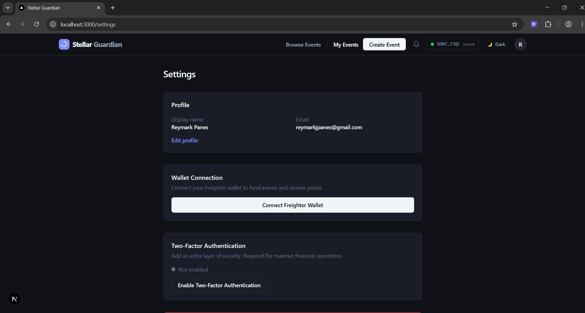
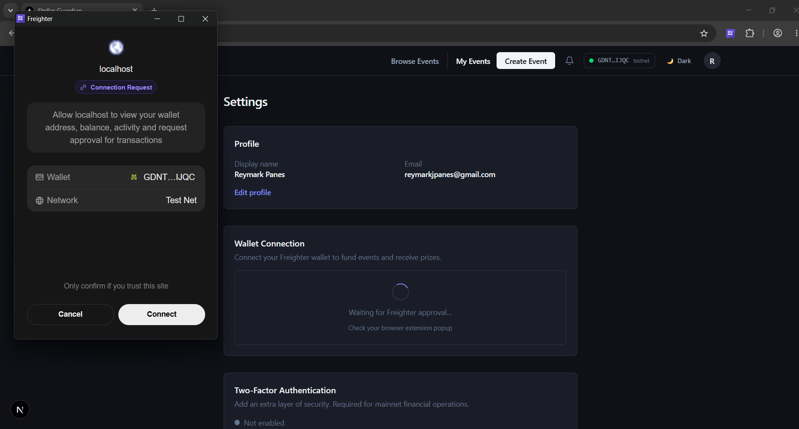
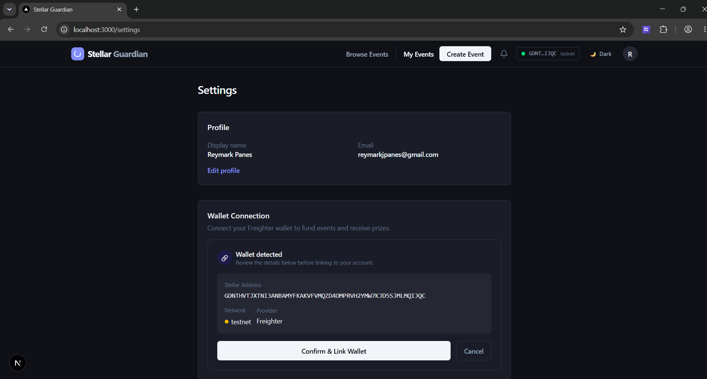
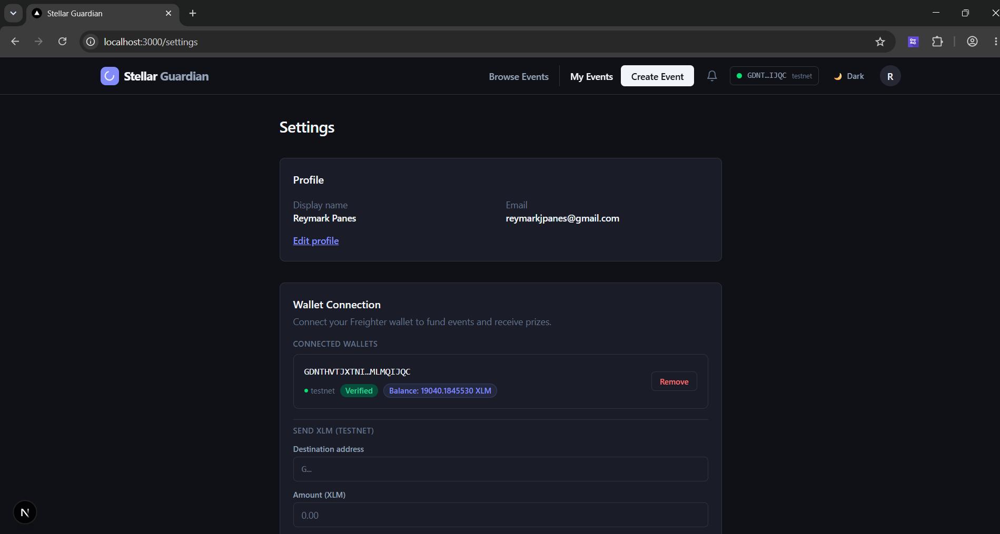
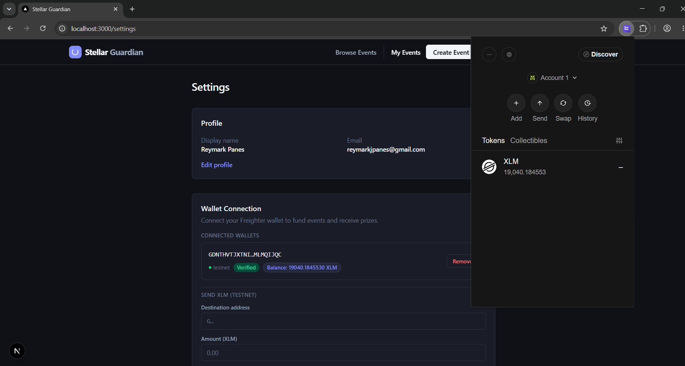
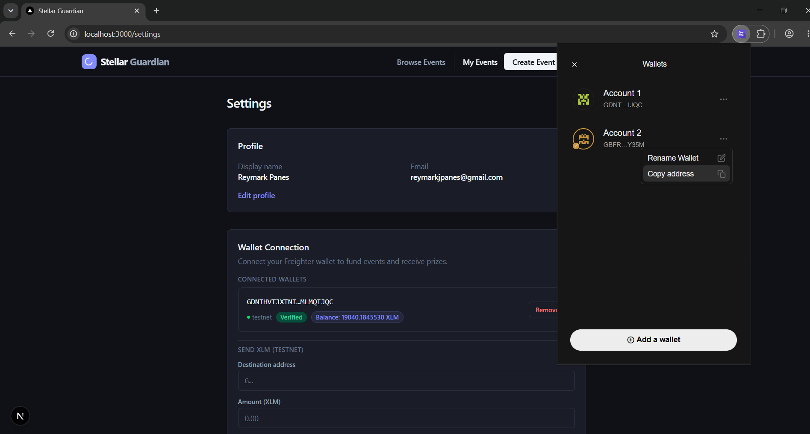
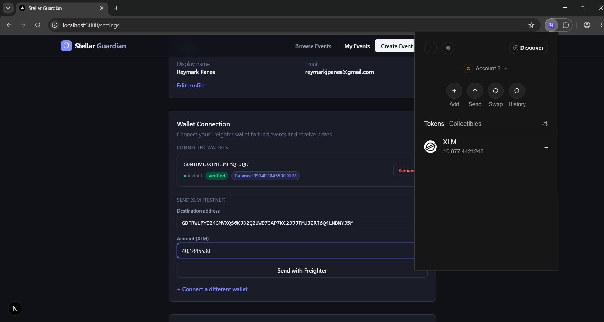
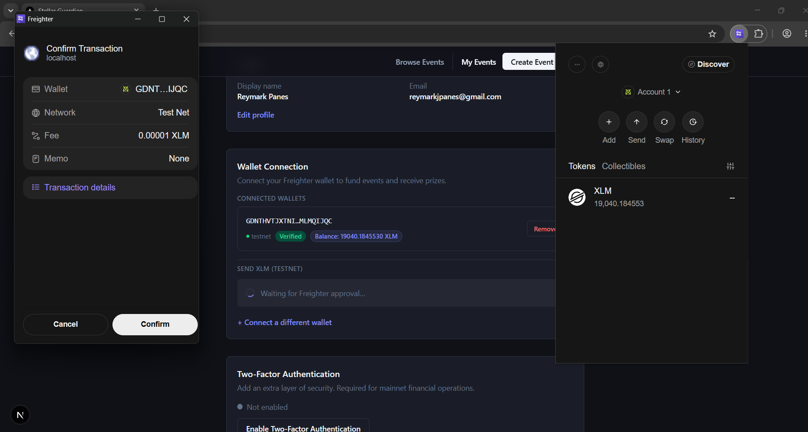
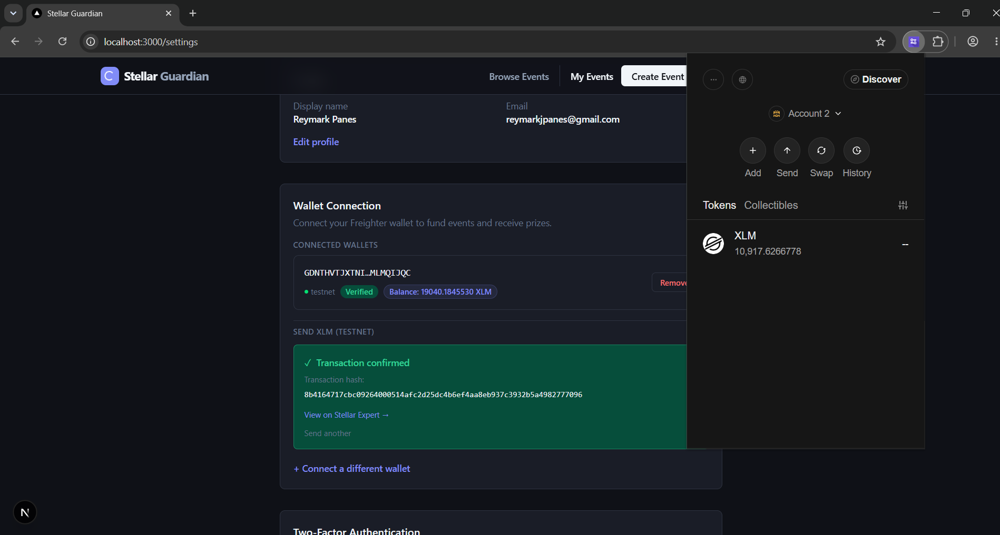
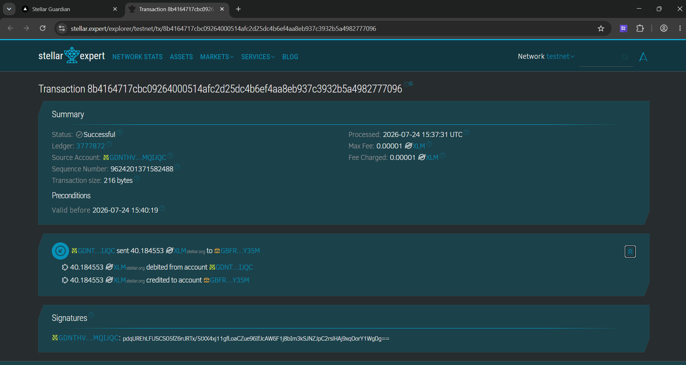

<div align="center">

# Stellar Guardian 3.0

**Decentralized Hackathon, Bounty & Event Management on the Stellar Network**

[](https://www.typescriptlang.org/)
[](https://nextjs.org/)
[](https://react.dev/)
[](https://supabase.com/)
[](https://stellar.org/)
[](https://tailwindcss.com/)
[](LICENSE)

---

Stellar Guardian 3.0 is a full-stack platform for running hackathons, competitive bounties, and grant programmes with trustless prize settlement via **Soroban smart contracts** on the **Stellar blockchain**. It handles the full lifecycle — from event creation and team formation through judging and ranked disbursement — with on-chain escrow as the settlement layer.

</div>

---

## Table of Contents

- [Features](#features)
- [Architecture](#architecture)
- [Tech Stack](#tech-stack)
- [Prerequisites](#prerequisites)
- [Local Setup](#local-setup)
- [Environment Variables](#environment-variables)
- [Database Migrations](#database-migrations)
- [Running the App](#running-the-app)
- [Scripts Reference](#scripts-reference)
- [Project Structure](#project-structure)
- [Demo Video](#demo-video)
- [Screenshots](#screenshots)
- [Stellar Builder Challenge](#stellar-builder-challenge)
- [Security](#security)
- [License](#license)

---

## Features

### 16-State Event Lifecycle Engine
A pure TypeScript state machine governs every event from draft to settlement. Transitions enforce business rules at the domain layer — independent of any framework or I/O — and are validated with property-based tests via `fast-check`.

**Lifecycle phases:** `Draft` → `Registration Open` → `Submissions Open` → `Review` → `Judging` → `Winner Selection` → `Escrow Funded` → `Disbursement` → `Completed` (with `Cancelled`, `Disputed`, and intermediate states).

### Soroban Smart Contract Escrow
Prize pools are held in a Soroban contract, not on the platform's balance sheet.

| Contract Operation | Trigger |
|---|---|
| `initialize` | Event transitions to funding phase |
| `deposit` | Organizer signs transaction via Freighter wallet |
| `lock` | Winners are finalized |
| `disburse` | Platform signs batch payout to ranked winners |
| `refund` | Event cancelled — funds returned to organizer |

All Soroban interactions simulate before submission, assemble resource requirements, and poll for confirmation.

### Role-Based Permission Engine
Ten roles (`Admin`, `Organizer`, `Judge`, `Participant`, `Sponsor`, `TeamLead`, `Reviewer`, `Auditor`, `Observer`, `Guest`) with a typed permission matrix enforced server-side on every API route via the `authorize()` middleware.

### Domain Event Bus
An in-process domain event bus decouples financial operations, audit logging, and notification delivery. Subscribers are registered at application bootstrap and process events asynchronously with `Promise.allSettled`.

### KMS Envelope Encryption
Platform signing keys are never stored in plaintext.

- **Development**: AES-256-GCM with HKDF-derived key from `LOCAL_ENCRYPTION_KEY`
- **Production**: AWS KMS envelope encryption (`kms:Encrypt` / `kms:Decrypt`)

### Typed Error Hierarchy
All API responses follow a canonical envelope schema. The error hierarchy (`AppError`, `ValidationError`, `AuthorizationError`, `NotFoundError`, `FinancialError`, `BlockchainError`) maps to specific HTTP status codes and is validated with property-based tests.

### Teams, Submissions & Judging
- Team creation, invitation links, and join request workflows
- Submission versioning with revision history
- Configurable scoring rubrics with automated leaderboard calculation
- Dispute resolution state machine

### Observability & Operations
- Structured logging via a centralised `logger` utility
- `/api/health` (liveness) and `/api/health/ready` (readiness) endpoints
- Vercel Cron jobs for idempotency key cleanup (`0 * * * *`) and escrow reconciliation (`*/15 * * * *`)
- Audit trail service logging all financial and state transition events

---

## Architecture

```
┌─────────────────────────────────────────────────────┐
│                  Next.js App Router                 │
│  app/(auth)/   app/(app)/   app/(public)/   app/api/ │
└───────────────────────┬─────────────────────────────┘
                        │
        ┌───────────────▼──────────────┐
        │        Service Layer         │  ← lib/services/
        │  EscrowService  KMSService   │
        │  AuditService   Notification │
        └───────────────┬──────────────┘
                        │
        ┌───────────────▼──────────────┐
        │        Domain Layer          │  ← lib/state-machine/
        │  EventStateMachine           │     lib/engines/
        │  EscrowStateMachine          │     lib/domain/
        │  DisputeStateMachine         │
        │  PermissionEngine            │
        │  WorkflowEngine              │
        └───────┬──────────────┬───────┘
                │              │
   ┌────────────▼───┐   ┌──────▼──────────────┐
   │  Supabase Pg   │   │  Stellar / Soroban  │
   │  (Postgres+RLS)│   │  soroban-escrow.ts  │
   └────────────────┘   └─────────────────────┘
```

The codebase has two coexisting layers (see `ARCHITECTURE_AUDIT.md` for full details):

- **`web/lib/`** — service-oriented flat layer (primary, ~70% complete)
- **`web/src/domains/`** — DDD/hexagonal bounded contexts (emerging, Teams + Submissions + Judging fully migrated)

---

## Tech Stack

| Layer | Technology |
|---|---|
| Framework | Next.js 16 (App Router), React 19 |
| Language | TypeScript 5.x |
| Database | Supabase (PostgreSQL + Row Level Security) |
| Auth | Supabase Auth with SSR cookie adapter |
| Styling | Tailwind CSS 4 |
| Blockchain | `@stellar/stellar-sdk` v16, Soroban RPC, Freighter API |
| Validation | Zod v4 |
| Testing | Vitest, fast-check (property-based), Playwright (E2E) |
| Email | Resend |
| Rate Limiting | Upstash Redis (falls back to in-memory) |
| Encryption | AWS KMS (prod) / AES-256-GCM (dev) |
| Deployment | Vercel (Cron + Edge Middleware) |

---

## Prerequisites

- **Node.js** 20 or later
- **npm** 10 or later
- **Supabase project** — [create one free](https://supabase.com/dashboard)
- **Freighter browser extension** — required for wallet interactions ([install](https://www.freighter.app/))
- **Stellar Testnet account** — fund one at the [Stellar Friendbot](https://friendbot.stellar.org)

---

## Local Setup

### 1. Clone and install

```bash
git clone https://github.com/reymarkjpanes/Stellarguardian3.0.git
cd Stellarguardian3.0

# Install root dev tooling
npm install

# Install web app dependencies
cd web && npm install && cd ..
```

### 2. Configure environment

```bash
cp web/.env.example web/.env.local
```

Open `web/.env.local` and fill in the required values. See [Environment Variables](#environment-variables) below for the full reference.

### 3. Apply database migrations

**Option A — Hosted Supabase project:**

Paste the contents of `web/supabase/combined_migration.sql` into the [Supabase SQL Editor](https://supabase.com/dashboard) and run it.

**Option B — Supabase CLI (local instance):**

```bash
cd web
npx supabase start          # starts local Postgres + Studio
npx supabase db push        # applies all migrations in order
```

### 4. Start the development server

```bash
# From the repo root
npm run dev
```

App is available at **http://localhost:3000**.

---

## Environment Variables

Copy `web/.env.example` to `web/.env.local`. The minimal set required to boot the app locally:

| Variable | Required | Description |
|---|---|---|
| `NEXT_PUBLIC_SUPABASE_URL` | ✅ | Supabase project URL |
| `NEXT_PUBLIC_SUPABASE_ANON_KEY` | ✅ | Supabase anon/public key |
| `SUPABASE_SERVICE_ROLE_KEY` | ✅ | Supabase service-role key (server-only, bypasses RLS) |
| `LOCAL_ENCRYPTION_KEY` | ✅ | 32+ character random string — AES-256-GCM key for dev KMS |
| `STELLAR_NETWORK_MODE` | ✅ | `testnet` or `mainnet` |
| `SOROBAN_RPC_URL` | ✅ | Soroban RPC endpoint (default: `https://soroban-testnet.stellar.org`) |
| `ESCROW_CONTRACT_ID` | ✅ | Deployed Soroban escrow contract ID |
| `NEXT_PUBLIC_SITE_URL` | ✅ | App base URL (default: `http://localhost:3000`) |
| `RESEND_API_KEY` | Optional | Transactional email — app degrades gracefully without it |
| `UPSTASH_REDIS_REST_URL` | Optional | Redis for distributed rate limiting — falls back to in-memory |
| `UPSTASH_REDIS_REST_TOKEN` | Optional | Upstash token |
| `CRON_SECRET` | Optional | Bearer secret for Vercel Cron route authentication |
| `KMS_KEY_ARN` + `AWS_REGION` | Production | AWS KMS key ARN — replaces `LOCAL_ENCRYPTION_KEY` in prod |

> **Never** commit `web/.env.local` or any file containing real secrets. It is covered by `.gitignore`.

---

## Database Migrations

Migrations live in `web/supabase/migrations/` and are numbered sequentially. They are idempotent and must be applied in order.

```
20250101000001_workspaces.sql
20250101000002_users.sql
20250101000003_teams.sql
20250101000004_events.sql
...
20250101000051_financial_transactions.sql
20250101000052_restrict_financial_rls.sql
```

A combined single-file version (`combined_migration.sql`) is kept in sync for quick setup on hosted projects.

To roll back a specific migration, use the corresponding file in `web/supabase/migrations_down/`.

---

## Running the App

| Command | From | Description |
|---|---|---|
| `npm run dev` | root | Start Next.js dev server with HMR |
| `npm run build` | root | Production build |
| `npm run start` | root | Run production build locally |
| `npm run lint` | root | ESLint across all files |

All root scripts proxy to `web/` via `npm --prefix web run <script>`.

---

## Scripts Reference

Run these from inside the `web/` directory:

| Script | Description |
|---|---|
| `npm run dev` | Next.js dev server (`localhost:3000`) |
| `npm run build` | Production build with type checking |
| `npm run start` | Serve the production build |
| `npm run lint` | ESLint |
| `npm run format` | Prettier write |
| `npm run format:check` | Prettier check (CI) |
| `npm run typecheck` | `tsc --noEmit` |
| `npm run test` | Vitest (single run) |
| `npm run test:watch` | Vitest in watch mode |
| `npm run test:coverage` | Vitest with V8 coverage report |
| `npm run seed` | Run database seed script |

---

## Project Structure

```
stellar-guardian-3.0/
├── web/                              # Next.js 16 application
│   ├── app/
│   │   ├── (auth)/                   # Login, signup routes
│   │   ├── (app)/                    # Authenticated app shell
│   │   │   ├── dashboard/
│   │   │   ├── events/[id]/          # Event detail + sub-routes
│   │   │   │   ├── teams/
│   │   │   │   ├── submissions/
│   │   │   │   ├── judging/
│   │   │   │   ├── winners/
│   │   │   │   ├── disputes/
│   │   │   │   └── escrow/
│   │   │   └── settings/
│   │   ├── (public)/                 # Public discover page
│   │   ├── api/                      # Route handlers
│   │   │   ├── events/[id]/
│   │   │   ├── health/
│   │   │   ├── wallets/
│   │   │   └── cron/
│   │   └── global-error.tsx
│   ├── components/                   # Reusable React components
│   │   ├── events/
│   │   ├── layout/
│   │   └── wallet/
│   ├── lib/
│   │   ├── auth/                     # Authorization middleware
│   │   ├── domain/                   # Domain event bus
│   │   ├── engines/
│   │   │   ├── permission/           # Role-permission matrix
│   │   │   └── workflow/             # Event workflow orchestration
│   │   ├── errors/                   # Typed error hierarchy + envelope
│   │   ├── events/subscribers/       # Domain event subscribers
│   │   ├── repositories/             # Data access layer
│   │   ├── services/
│   │   │   └── escrow/               # Funding, disbursement, settlement, refund
│   │   ├── state-machine/            # Event, escrow, dispute state machines
│   │   └── stellar/                  # Soroban contract client
│   ├── src/domains/                  # DDD bounded contexts (Teams, Submissions, Judging, Prizes, Rankings)
│   ├── supabase/
│   │   ├── migrations/               # Sequential SQL migrations
│   │   ├── migrations_down/          # Rollback scripts
│   │   └── combined_migration.sql    # Single-file for hosted setup
│   ├── middleware.ts                 # Edge auth + CSP
│   └── vercel.json                   # Cron schedule
├── contracts/                        # Soroban smart contracts (Rust)
├── .agents/                          # AI agent skills and rules
├── .kiro/                            # Kiro specs and steering rules
└── package.json                      # Root script proxy
```

---

## Demo Video

### Level 1 — Video Demo

▶️ [Watch on Google Drive](https://drive.google.com/file/d/1K4lYCkc9Mw61nKVQJ3V5mIvA76o81oo2/view?usp=sharing)

---

## Screenshots























---

## Stellar Builder Challenge

This project is a submission for the **Stellar Journey to Mastery — Monthly Builder Challenges (White Belt)**.

### Requirement Mapping

| Requirement | Implementation |
|---|---|
| Wallet setup & connection | `web/components/wallet/wallet-connect.tsx` — Freighter API integration |
| Balance display | `web/app/(app)/settings/page.tsx` + `/api/wallets/[public_key]/balance` — live XLM balance via Horizon |
| Transaction flow | `web/app/(app)/events/[id]/escrow/page.tsx` — organizer funds escrow by signing a Soroban `deposit` transaction via Freighter |
| Transaction result | Real-time feedback displayed post-signing with on-chain confirmation polling |

### Network Configuration

The app defaults to **Stellar Testnet**. To test locally:

1. Install the [Freighter extension](https://www.freighter.app/) and set it to Testnet
2. Fund a testnet account at `https://friendbot.stellar.org?addr=<YOUR_PUBLIC_KEY>`
3. Set `STELLAR_NETWORK_MODE=testnet` in `.env.local`
4. Deploy the Soroban escrow contract to testnet and set `ESCROW_CONTRACT_ID`

---

## Security

Security is a first-class concern given the financial nature of the platform.

- **Secrets management**: Platform signing keys are KMS-encrypted at rest; never stored in plaintext
- **Row Level Security**: All Supabase tables enforce RLS policies; the service-role key is never exposed to the browser
- **Server-only boundaries**: `import "server-only"` prevents sensitive modules from being bundled client-side
- **Input validation**: All API input is parsed through Zod schemas before reaching service logic
- **Rate limiting**: Per-route rate limiting via Upstash Redis with in-memory fallback
- **CSP**: Content Security Policy headers with per-request nonces enforced at the middleware layer
- **Audit trail**: All financial operations and state transitions are logged via the audit service

To report a vulnerability, please open a private GitHub Security Advisory rather than a public issue.

---

## License

This project is licensed under the [MIT License](LICENSE).
