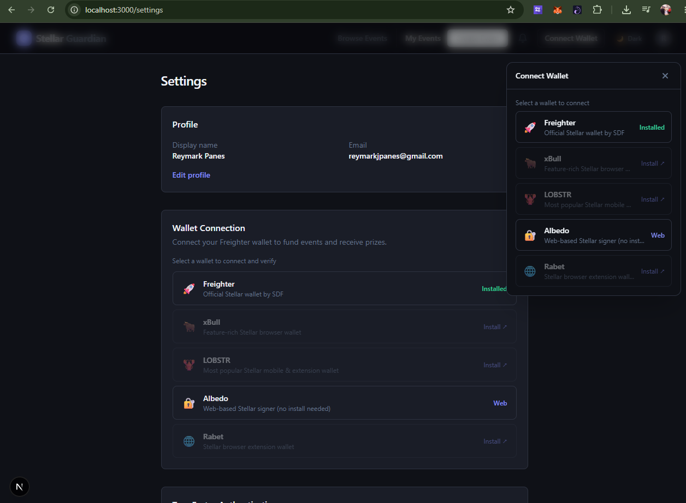
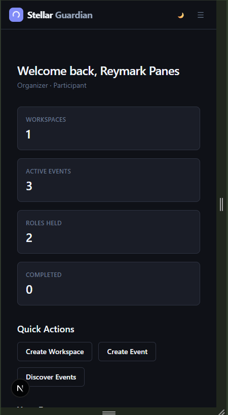
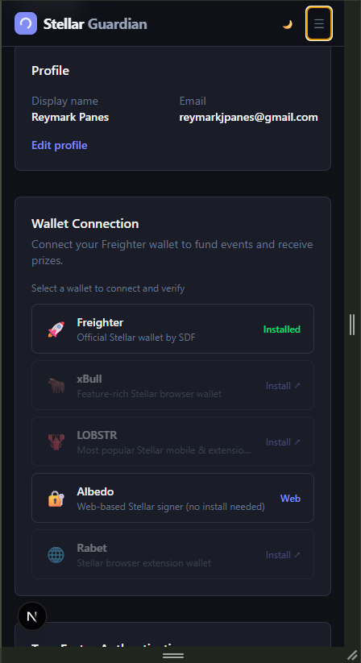
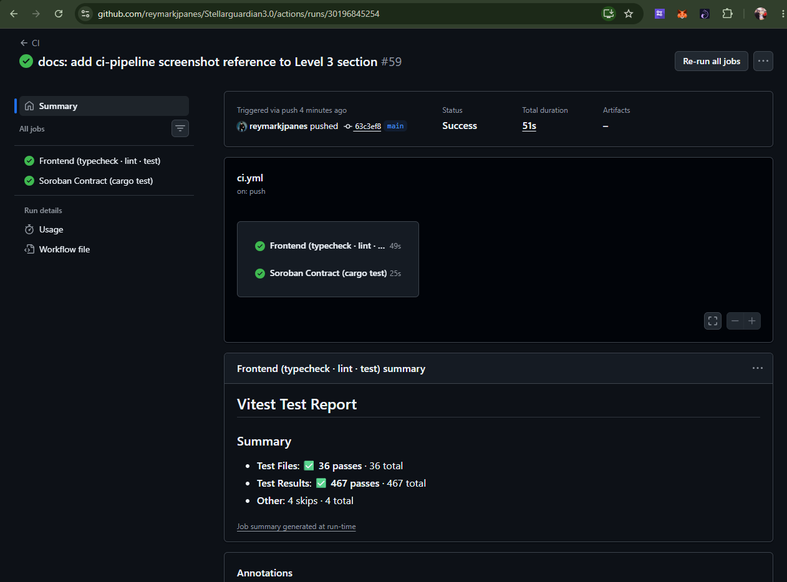
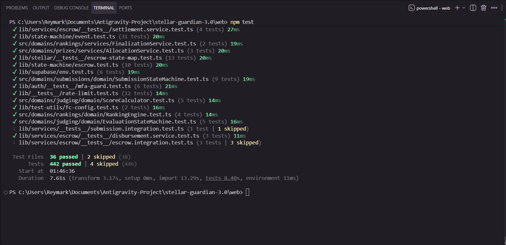

<div align="center">

# Stellar Guardian 3.0

**Decentralized Hackathon, Bounty & Event Management on the Stellar Network**

[](https://github.com/reymarkjpanes/Stellarguardian3.0/actions/workflows/ci.yml)
[](https://www.typescriptlang.org/)
[](https://nextjs.org/)
[](https://react.dev/)
[](https://supabase.com/)
[](https://stellar.org/)
[](https://tailwindcss.com/)
[](LICENSE)
[](https://stellarguardian3-0-delta1.vercel.app)

---

Stellar Guardian 3.0 is a full-stack platform for running hackathons, competitive bounties, and grant programmes with trustless prize settlement via **Soroban smart contracts** on the **Stellar blockchain**. It handles the full lifecycle — from event creation and team formation through judging and ranked disbursement — with on-chain escrow as the settlement layer.

</div>

---

## Table of Contents

- [Problem](#problem)
- [Solution](#solution)
- [Target Users](#target-users)
- [Why Stellar](#why-stellar)
- [Key Features](#key-features)
- [Architecture](#architecture)
- [Tech Stack](#tech-stack)
- [Smart Contract](#smart-contract)
- [Contract Functions](#contract-functions)
- [Escrow Lifecycle](#escrow-lifecycle)
- [Contract Properties](#contract-properties)
- [Stellar Features Used](#stellar-features-used)
- [Prerequisites](#prerequisites)
- [Installation](#installation)
- [Environment Setup](#environment-setup)
- [Database Setup](#database-setup)
- [Running Locally](#running-locally)
- [Available Commands](#available-commands)
- [Project Structure](#project-structure)
- [Blockchain Integration](#blockchain-integration)
- [Demo Video](#demo-video)
- [Demo Flow](#demo-flow)
- [Important Usage Notes](#important-usage-notes)
- [Screenshots — Level 1](#screenshots--level-1)
- [Screenshots — Level 2](#screenshots--level-2)
- [Screenshots — Level 3](#screenshots--level-3)
- [Stellar Builder Challenge — Level 2](#stellar-builder-challenge--level-2)
- [Stellar Builder Challenge — Level 3](#stellar-builder-challenge--level-3)
- [Deployment](#deployment)
- [Troubleshooting](#troubleshooting)
- [Security](#security)
- [License](#license)

---

## Problem

Running hackathons, bounties, and grant programmes at scale comes with a trust problem. Organisers hold prize funds on their own accounts or through centralised payment processors — participants have no on-chain guarantee that funds actually exist or will be disbursed fairly. Disputes are resolved manually, payouts can be delayed or withheld, and there is no transparent audit trail.

---

## Solution

Stellar Guardian 3.0 eliminates the trust gap by holding prize pools in a **Soroban smart contract escrow** — not on the platform's balance sheet. Funds are locked on-chain when an event is funded, and released automatically to ranked winners when judging is finalised. Every state transition — from event creation through to disbursement — is recorded on-chain and verifiable by anyone.

- Organisers can only deposit, not withdraw once funded
- Winners receive exact ranked amounts with no manual intervention
- Platform fees are transparently snapshotted at job creation time
- Disputes trigger a separate on-chain resolution state machine

---

## Target Users

| Role | What they do on the platform |
|---|---|
| **Organiser** | Creates events, sets prize pools, funds the escrow via Freighter, selects winners |
| **Participant** | Registers for events, submits projects, can file disputes |
| **Team Captain** | Leads a team, creates/updates the submission, accepts join requests |
| **Judge** | Reviews and scores assigned submissions against configured rubrics |
| **Sponsor** | Contributes to prize pools via `admin_deposit`; monitors escrow and milestones |
| **Workspace Owner / Admin** | Manages the workspace, members, and invitations; can run events |
| **Platform Admin** | Full platform access — resolves disputes, manages escrow health, oversees disbursements |

---

## Why Stellar

| Need | Why Stellar delivers it |
|---|---|
| Fast settlement | Transactions finalise in 3–5 seconds |
| Low fees | Fractions of a cent — viable for micro-prize distributions |
| Smart contracts | Soroban provides a safe, resource-metered contract environment |
| Native assets | XLM as a first-class payment asset — no wrapping or bridging |
| Wallet UX | Freighter gives users a familiar browser-extension signing experience |
| Transparency | Every contract interaction is verifiable on Stellar Expert |

---

## Key Features

### 16-State Event Lifecycle Engine
A pure TypeScript state machine governs every event from draft to settlement. Validated with property-based tests via `fast-check`.

`Draft` → `Published` → `RegistrationOpen` → `RegistrationClosed` → `TeamFormationLocked` → `SubmissionOpen` → `SubmissionClosed` → `JudgingRound1` → `JudgingRound2` → `WinnerVerification` → `DisputeWindow` → `PrizeApproved` → `EscrowRelease` → `Completed` → `Archived` (+ `Cancelled` at any stage)

### Soroban Smart Contract Escrow
| Contract Operation | Trigger |
|---|---|
| `initialize` | Platform creates escrow (admin + organizer + event_id + target + token) |
| `deposit` | Organizer signs via Freighter — funds locked into contract |
| `admin_deposit` | Platform authorizes a sponsor deposit from any address |
| `lock` | Platform locks once fully funded |
| `disburse` | Single-batch payout → transitions to Released |
| `disburse_batch` | Multi-batch payout (stays Locked until `finalize`) |
| `finalize` | Platform finalises all batches → Released |
| `refund` | Platform returns all funds to organizer on cancellation |

### Role-Based Permission Engine
Ten roles with typed RBAC + ABAC enforced server-side on every API route.

### 5 Wallet Integrations
Freighter, xBull, LOBSTR, Albedo, and Rabet via a unified adapter interface with challenge-response ownership verification.

### KMS Envelope Encryption
- **Development**: AES-256-GCM with HKDF-derived key from `LOCAL_ENCRYPTION_KEY`
- **Production**: AWS KMS envelope encryption

### Domain Event Bus
In-process event bus decouples financial operations, audit logging, and notification delivery.

### Typed Error Hierarchy
All API responses follow a canonical envelope schema. The error hierarchy maps to specific HTTP status codes and is validated with property-based tests.

---

## Architecture

```
┌─────────────────────────────────────────────────────┐
│                  Next.js App Router                 │
│  app/(auth)/   app/(app)/   app/(public)/   app/api/ │
└───────────────────────┬─────────────────────────────┘
                        │
        ┌───────────────▼──────────────┐
        │        Service Layer         │  ← lib/services/
        │  EscrowService  KMSService   │
        │  AuditService   Notification │
        └───────────────┬──────────────┘
                        │
        ┌───────────────▼──────────────┐
        │        Domain Layer          │  ← lib/state-machine/
        │  EventStateMachine           │     lib/engines/
        │  EscrowStateMachine          │     lib/domain/
        │  DisputeStateMachine         │
        │  PermissionEngine            │
        └───────┬──────────────┬───────┘
                │              │
   ┌────────────▼───┐   ┌──────▼──────────────┐
   │  Supabase Pg   │   │  Stellar / Soroban  │
   │  (Postgres+RLS)│   │  soroban-escrow.ts  │
   └────────────────┘   └─────────────────────┘
```

---

## Tech Stack

| Layer | Technology | Version |
|---|---|---|
| Framework | Next.js (App Router) | 16.2.10 |
| UI Library | React | 19.2.4 |
| Language | TypeScript | ^5 |
| Database | Supabase (PostgreSQL + RLS) | supabase-js 2.110.7 |
| Auth | Supabase Auth with SSR cookie adapter | @supabase/ssr 0.12.3 |
| Styling | Tailwind CSS | ^4.3.3 |
| Blockchain | `@stellar/stellar-sdk` | ^16.0.1 |
| Wallet | `@stellar/freighter-api` | ^6.0.1 |
| Validation | Zod | ^4.4.3 |
| State/Data fetching | TanStack React Query | ^5.101.2 |
| Testing | Vitest + fast-check + Playwright | ^4.1.10 |
| Email | Resend | ^4.1.2 |
| Rate Limiting | Upstash Redis (in-memory fallback) | ^1.38.0 |
| Encryption | AWS KMS (prod) / AES-256-GCM (dev) | @aws-sdk/client-kms ^3 |
| Deployment | Vercel | — |

---

## Smart Contract

The escrow logic runs on a **Soroban smart contract** written in Rust — `contracts/escrow/src/lib.rs`.

### Contract ID (Deployed on Stellar Testnet)

```
CAF2TCCKNRTUNANF6YFMRU764GQKGCSLRN3RKQEO4XJJGMCQF5ED6ZAT
```

| Explorer | Link |
|---|---|
| Stellar Lab | [View on Stellar Lab](https://lab.stellar.org/smart-contracts/contract-explorer?network=testnet&contractId=CAF2TCCKNRTUNANF6YFMRU764GQKGCSLRN3RKQEO4XJJGMCQF5ED6ZAT) |
| Stellar Expert | [View on Stellar Expert](https://stellar.expert/explorer/testnet/contract/CAF2TCCKNRTUNANF6YFMRU764GQKGCSLRN3RKQEO4XJJGMCQF5ED6ZAT) |

---

## Contract Functions

| Function | Caller | Description |
|---|---|---|
| `initialize(admin, organizer, event_id, target, token)` | Platform | One-time setup |
| `deposit(from, amount)` | Organizer | Locks XLM into the contract |
| `admin_deposit(from, amount)` | Platform | Sponsor deposit from any address |
| `lock()` | Platform | Locks once fully funded |
| `disburse(recipients, amounts)` | Platform | Single-batch → Released |
| `disburse_batch(recipients, amounts)` | Platform | Multi-batch, stays Locked until `finalize()` |
| `finalize()` | Platform | Marks all batches complete → Released |
| `refund()` | Platform | Returns balance to organizer |
| `get_balance()` | Anyone | Current escrow balance in stroops |
| `get_state()` | Anyone | Numeric state (0–5) |
| `get_target()` | Anyone | Configured funding target |
| `get_disbursed_total()` | Anyone | Cumulative amount disbursed |
| `is_locked()` | Anyone | True if Locked state |
| `get_organizer()` | Anyone | Organizer's address |
| `get_event_id()` | Anyone | Event UUID bytes |

---

## Escrow Lifecycle

```
PendingFunding (0) → PartiallyFunded (1) → FullyFunded (2) → Locked (3) → Released (4)
                                                                          ↘ Refunded (5)
```

---

## Contract Properties

| Property | Description |
|---|---|
| Conservation of funds | Balance decrements by exactly the disbursed amount on every payout |
| Partial deposits | Multiple deposits until target is reached |
| Sponsor deposits | `admin_deposit` allows contributions from any address |
| Authorization | Every state-changing function calls `require_auth()` |
| On-chain events | Every state change emits a contract event |
| TTL extension | Storage TTL refreshed on every write |

---

## Stellar Features Used

| Feature | Usage |
|---|---|
| Soroban smart contracts | Full escrow lifecycle |
| XLM (native asset) | Prize pool denomination and settlement |
| `require_auth()` | Wallet-based authorization |
| On-chain events | Audit trail for every state transition |
| Persistent storage | Per-event state in contract instance storage |
| TTL extension | Prevents contract expiry during active use |

---

## Prerequisites

**For the frontend:**

- **Node.js** 24 or later
- **npm** 10 or later
- **Supabase project** — [create one free](https://supabase.com/dashboard)
- **Freighter browser extension** — set to Testnet ([install](https://www.freighter.app/))
- **Stellar Testnet account** — fund via [Friendbot](https://friendbot.stellar.org)

**For the smart contract (only if redeploying):**

- **Rust** stable 1.84+ with `wasm32v1-none` target (`rustup target add wasm32v1-none`)
- **Stellar CLI** v25+
- Funded testnet account

---

## Installation

```bash
# 1. Clone
git clone https://github.com/reymarkjpanes/Stellarguardian3.0.git
cd Stellarguardian3.0

# 2. Install root tooling
npm install

# 3. Install web app dependencies
cd web && npm install && cd ..
```

---

## Environment Setup

```bash
cp .env.example web/.env.local
```

Open `web/.env.local` and fill in:

```env
# Supabase
NEXT_PUBLIC_SUPABASE_URL=https://your-project.supabase.co
NEXT_PUBLIC_SUPABASE_ANON_KEY=your-anon-key
SUPABASE_SERVICE_ROLE_KEY=your-service-role-key

# Encryption — min 32 chars: node -e "console.log(require('crypto').randomBytes(32).toString('hex'))"
LOCAL_ENCRYPTION_KEY=your-32-char-secret

# Stellar
STELLAR_NETWORK_MODE=testnet
STELLAR_MAINNET_ENABLED=false
SOROBAN_RPC_URL=https://soroban-testnet.stellar.org
ESCROW_CONTRACT_ID=CAF2TCCKNRTUNANF6YFMRU764GQKGCSLRN3RKQEO4XJJGMCQF5ED6ZAT

# App
NEXT_PUBLIC_SITE_URL=http://localhost:3000
CRON_SECRET=your-cron-secret   # generate: node -e "console.log(require('crypto').randomBytes(32).toString('hex'))"

# Optional
RESEND_API_KEY=
UPSTASH_REDIS_REST_URL=
UPSTASH_REDIS_REST_TOKEN=
```

**Full variable reference:**

| Variable | Required | Description |
|---|---|---|
| `NEXT_PUBLIC_SUPABASE_URL` | ✅ | Supabase project URL |
| `NEXT_PUBLIC_SUPABASE_ANON_KEY` | ✅ | Supabase anon key (client-side, subject to RLS) |
| `SUPABASE_SERVICE_ROLE_KEY` | ✅ | Service role key (server-only, bypasses RLS) |
| `LOCAL_ENCRYPTION_KEY` | ✅ | 32+ char string — dev KMS key |
| `STELLAR_NETWORK_MODE` | ✅ | `testnet` or `mainnet` |
| `STELLAR_MAINNET_ENABLED` | ✅ | `true` only when targeting mainnet |
| `SOROBAN_RPC_URL` | ✅ | Soroban RPC endpoint |
| `ESCROW_CONTRACT_ID` | ✅ | Deployed Soroban contract ID |
| `NEXT_PUBLIC_SITE_URL` | ✅ | App base URL |
| `CRON_SECRET` | ✅ | Bearer secret for Vercel Cron routes |
| `RESEND_API_KEY` | Optional | Transactional email |
| `UPSTASH_REDIS_REST_URL` + `TOKEN` | Optional | Distributed rate limiting |
| `KMS_KEY_ARN` + `AWS_REGION` | Production | AWS KMS (replaces `LOCAL_ENCRYPTION_KEY`) |
| `NEXT_PUBLIC_TURNSTILE_SITE_KEY` + `TURNSTILE_SECRET_KEY` | Removed | Cloudflare Turnstile CAPTCHA (removed — no longer used) |

> **Never** commit `web/.env.local`. It is covered by `.gitignore`.

---

## Database Setup

Migrations live in `web/supabase/migrations/`. Apply them using one of these methods:

**Option A — Hosted Supabase (recommended for getting started):**

Paste `web/supabase/combined_migration.sql` into the [Supabase SQL Editor](https://supabase.com/dashboard) and run it.

**Option B — Supabase CLI:**

```bash
cd web
npx supabase start
npx supabase db push
```

**Seed initial data:**

```bash
cd web && npm run seed
```

To roll back a specific migration, use the corresponding file in `web/supabase/migrations_down/`.

---

## Running Locally

```bash
npm run dev
```

App runs at **http://localhost:3000**.

Make sure you have:
1. Completed [Environment Setup](#environment-setup)
2. Applied [Database migrations](#database-setup)
3. Freighter extension installed and set to **Testnet**

---

## Available Commands

**From the repo root:**

| Command | Description |
|---|---|
| `npm run dev` | Start dev server with HMR |
| `npm run build` | Production build |
| `npm run start` | Serve production build |
| `npm run lint` | ESLint |

**From `web/`:**

| Command | Description |
|---|---|
| `npm run dev` | Next.js dev server (`localhost:3000`) |
| `npm run build` | Production build with type checking |
| `npm run typecheck` | `tsc --noEmit` |
| `npm run lint` | ESLint |
| `npm run format` | Prettier write |
| `npm run format:check` | Prettier check (CI) |
| `npm run test` | Vitest unit tests (single run) |
| `npm run test:watch` | Vitest watch mode |
| `npm run test:coverage` | Vitest with V8 coverage |
| `npm run test:e2e` | Playwright E2E |
| `npm run seed` | Run database seed script |

**Smart contract (from `contracts/escrow/`):**

```bash
cargo test --locked
cargo build --locked --target wasm32v1-none --release
cargo clippy --all-targets -- -D warnings
cargo fmt --all -- --check
```

---

## Project Structure

```
stellar-guardian-3.0/
├── web/                              # Next.js 16 application
│   ├── app/
│   │   ├── (auth)/                   # Login, signup, reset-password
│   │   ├── (app)/                    # Authenticated app shell
│   │   │   ├── dashboard/
│   │   │   ├── events/[id]/
│   │   │   │   ├── teams/
│   │   │   │   ├── submissions/
│   │   │   │   ├── judging/
│   │   │   │   ├── winners/
│   │   │   │   ├── disputes/
│   │   │   │   └── escrow/
│   │   │   └── settings/
│   │   ├── (public)/                 # Public discover page
│   │   └── api/                      # Route handlers
│   ├── components/                   # Shared React components
│   │   ├── events/
│   │   ├── layout/
│   │   └── wallet/
│   ├── lib/
│   │   ├── auth/                     # Authorization middleware
│   │   ├── domain/                   # Domain event bus
│   │   ├── engines/
│   │   │   ├── permission/           # Role-permission matrix
│   │   │   └── workflow/             # Event workflow orchestration
│   │   ├── errors/                   # Typed error hierarchy
│   │   ├── services/
│   │   │   └── escrow/               # Funding, disbursement, settlement, refund
│   │   ├── state-machine/            # Event, escrow, dispute state machines
│   │   └── stellar/                  # Soroban contract client
│   ├── src/domains/                  # DDD bounded contexts
│   │   ├── judging/
│   │   ├── submissions/
│   │   ├── teams/
│   │   ├── members/
│   │   ├── rankings/
│   │   └── escrow/
│   ├── supabase/
│   │   ├── migrations/               # Sequential SQL migrations
│   │   ├── migrations_down/          # Rollback scripts
│   │   └── combined_migration.sql
│   └── tests/
│       ├── unit/
│       └── e2e/
├── contracts/
│   └── escrow/                       # Soroban smart contract (Rust)
│       ├── src/lib.rs
│       ├── Cargo.toml
│       └── rust-toolchain.toml
├── .github/workflows/ci.yml
└── package.json
```

---

## Blockchain Integration

### Supported Wallets

| Wallet | Provider Key | Type | Install |
|---|---|---|---|
| Freighter | `"Freighter"` | Browser extension | [freighter.app](https://www.freighter.app/) |
| xBull | `"xBull"` | Browser extension | [xbull.app](https://xbull.app/) |
| LOBSTR | `"LOBSTR"` | Extension + mobile | [lobstr.co](https://lobstr.co/) |
| Albedo | `"Albedo"` | Web-based popup | [albedo.link](https://albedo.link/) |
| Rabet | `"Rabet"` | Browser extension | [rabet.io](https://rabet.io/) |

**Adding a new wallet** — implement `WalletAdapter` in `web/lib/wallet/<name>.ts` and register in `web/lib/wallet/registry.ts`. No other changes needed.

### Wallet Ownership Verification (Challenge-Response)

```
1. POST /api/wallets/challenge  { publicKey }
   ← { challengeId, nonce: "hex_32_bytes" }

2. wallet.signMessage(nonce)
   ← signature (base64)

3. POST /api/wallets/verify  { challengeId, signature }
   ← { publicKey, verified: true }
```

Challenge expires after **5 minutes** and is single-use.

### Transaction Lifecycle

```
idle → preparing → simulating → awaiting_signature
     → submitting → pending_confirmation → confirmed ✓
                                         → failed    ✗
```

### Blockchain Error Codes

| Code | When | Retryable |
|---|---|---|
| `WALLET_NOT_INSTALLED` | Extension missing | No |
| `WALLET_CONNECTION_REJECTED` | User dismissed | Yes |
| `WALLET_SIGNATURE_REJECTED` | User declined signing | Yes |
| `WALLET_NETWORK_MISMATCH` | Wrong network | Yes |
| `SIMULATION_FAILED` | Invalid state/params | No |
| `INSUFFICIENT_BALANCE` | Not enough XLM | No |
| `CONTRACT_INVALID_STATE` | Wrong escrow state | No |
| `TRANSACTION_TIMEOUT` | Confirmation timed out | Yes |

### Real-Time Sync

Blockchain events sync to the frontend via two channels:
1. **Supabase Realtime** — instant DB-level updates
2. **Contract event polling** — `GET /api/events/[id]/contract-events` polls Soroban RPC every 15 seconds

---

## Demo Video

▶️ [Watch on Google Drive](https://drive.google.com/file/d/1K4lYCkc9Mw61nKVQJ3V5mIvA76o81oo2/view?usp=sharing)

---

## Demo Flow

1. **Sign up / Log in** — create an account and verify your email
2. **Connect Freighter wallet** — link your Stellar Testnet wallet from Settings; verified on-chain before storing
3. **Create an event** (`Draft`) — fill in details, assign judges, set deadline, then publish
4. **Published → RegistrationOpen** — organiser opens registration; participants join
5. **RegistrationClosed → TeamFormationLocked** — organiser closes registration and locks teams
6. **SubmissionOpen → SubmissionClosed** — participants submit; organiser closes window
7. **JudgingRound1 / JudgingRound2** — judges score submissions against configured rubric
8. **WinnerVerification → DisputeWindow** — organiser confirms winners; dispute window opens
9. **PrizeApproved** — dispute window closes with no unresolved disputes
10. **Fund escrow** — organiser signs a Soroban `deposit` transaction via Freighter
11. **EscrowRelease** — platform locks and calls `disburse` / `disburse_batch` + `finalize`; each ranked winner receives XLM
12. **Completed** — all disbursements confirmed on-chain
13. **Verify on-chain** — [Stellar Expert](https://stellar.expert/explorer/testnet/contract/CAF2TCCKNRTUNANF6YFMRU764GQKGCSLRN3RKQEO4XJJGMCQF5ED6ZAT)

---

## Important Usage Notes

> These notes apply when running on **Stellar Testnet**.

- **Freighter must be set to Testnet** before connecting
- **Keep at least 1 XLM reserve** — Stellar requires a minimum balance
- **Transaction timeout** — signing window is 180 seconds; expired transactions must be retried
- **Testnet resets** — if the contract ID stops responding, redeploy and update `ESCROW_CONTRACT_ID`
- **Soroban simulation** — all contract calls simulate first; if simulation fails, check the contract is live
- **Email (Resend)** — optional; app works without a key, emails silently skip
- **Rate limiting** — falls back to in-memory without Redis; resets on server restart

---

## Screenshots — Level 1


---

## Screenshots — Level 2




---

## Screenshots — Level 3






---

## Stellar Builder Challenge — Level 2

| Requirement | Evidence |
|---|---|
| **Wallet options available** | 5 wallets supported: Freighter, xBull, LOBSTR, Albedo, Rabet |
| **Deployed contract address** | [`CAF2TCCKNRTUNANF6YFMRU764GQKGCSLRN3RKQEO4XJJGMCQF5ED6ZAT`](https://stellar.expert/explorer/testnet/contract/CAF2TCCKNRTUNANF6YFMRU764GQKGCSLRN3RKQEO4XJJGMCQF5ED6ZAT) |
| **Transaction hash (contract call)** | [`a9f5de73ef0b8453f1635e53b6c6e019f09bb27153cdcadf1532129ffa095a00`](https://stellar.expert/explorer/testnet/tx/a9f5de73ef0b8453f1635e53b6c6e019f09bb27153cdcadf1532129ffa095a00) |

**Verify on Stellar Expert:**
- 🔗 [Contract Explorer](https://stellar.expert/explorer/testnet/contract/CAF2TCCKNRTUNANF6YFMRU764GQKGCSLRN3RKQEO4XJJGMCQF5ED6ZAT)
- 🔗 [Transaction Proof (`initialize` call)](https://stellar.expert/explorer/testnet/tx/a9f5de73ef0b8453f1635e53b6c6e019f09bb27153cdcadf1532129ffa095a00)

---

## Stellar Builder Challenge — Level 3

| Requirement | Evidence |
|---|---|
| **Contract deployment address** | [`CAF2TCCKNRTUNANF6YFMRU764GQKGCSLRN3RKQEO4XJJGMCQF5ED6ZAT`](https://stellar.expert/explorer/testnet/contract/CAF2TCCKNRTUNANF6YFMRU764GQKGCSLRN3RKQEO4XJJGMCQF5ED6ZAT) |
| **Transaction hash (contract interaction)** | [`a9f5de73ef0b8453f1635e53b6c6e019f09bb27153cdcadf1532129ffa095a00`](https://stellar.expert/explorer/testnet/tx/a9f5de73ef0b8453f1635e53b6c6e019f09bb27153cdcadf1532129ffa095a00) |
| **Mobile responsive UI** | Screenshots above (Dashboard + Wallet on mobile viewport) |
| **CI/CD pipeline** | [GitHub Actions →](https://github.com/reymarkjpanes/Stellarguardian3.0/actions) — screenshot above |
| **Test output (3+ passing tests)** | 442 unit tests passing — screenshot above |
| **Demo video** | [▶️ Watch Demo Video](https://drive.google.com/file/d/1K4lYCkc9Mw61nKVQJ3V5mIvA76o81oo2/view?usp=sharing) |

### Test Results Summary

```
 Test Files  36 passed | 1 skipped (38)
      Tests  442 passed | 4 skipped (446)
   Duration  ~10s

Coverage includes:
- State machine property tests (fast-check)
- Escrow lifecycle transitions
- Permission engine (10 roles × 6 actions × 13 resource categories)
- Typed error hierarchy
- Soroban contract unit tests (Rust: cargo test --locked)
```

### Verified Links

- 🚀 **Live Deployment:** [stellarguardian3-0-delta1.vercel.app](https://stellarguardian3-0-delta1.vercel.app)
- 🔗 **Contract on Stellar Expert:** [View Contract](https://stellar.expert/explorer/testnet/contract/CAF2TCCKNRTUNANF6YFMRU764GQKGCSLRN3RKQEO4XJJGMCQF5ED6ZAT)
- 🔗 **Contract on Stellar Lab:** [View in Lab](https://lab.stellar.org/smart-contracts/contract-explorer?network=testnet&contractId=CAF2TCCKNRTUNANF6YFMRU764GQKGCSLRN3RKQEO4XJJGMCQF5ED6ZAT)
- 🔗 **TX Proof (initialize):** [View Transaction](https://stellar.expert/explorer/testnet/tx/a9f5de73ef0b8453f1635e53b6c6e019f09bb27153cdcadf1532129ffa095a00)
- 🔗 **CI/CD Pipeline:** [GitHub Actions](https://github.com/reymarkjpanes/Stellarguardian3.0/actions)
- 🔗 **Repository:** [github.com/reymarkjpanes/Stellarguardian3.0](https://github.com/reymarkjpanes/Stellarguardian3.0)

---

## Deployment & Backend Architecture

**🌐 Live Production URL: [https://stellarguardian3-0-delta1.vercel.app](https://stellarguardian3-0-delta1.vercel.app)**

Stellar Guardian 3.0 uses a modern **Full-Stack Next.js (App Router) + BaaS** architecture. There is **no separate backend application** (like Express or Python) to deploy.

- **The Node.js Backend:** The backend logic lives directly inside the `web/app/api/` and `web/lib/services/` directories. Vercel automatically deploys these as Serverless Functions.
- **The Database Backend:** Supabase acts as the primary data backend, handling authentication and database (with Row Level Security).
- **The Financial Backend:** The Soroban smart contract on the Stellar blockchain acts as the decentralized backend for all escrow and payout logic.

### Step-by-Step Production Deployment Guide

**1. Database Deployment (Supabase)**
1. Create a new project in the [Supabase Dashboard](https://supabase.com/dashboard).
2. Go to the **SQL Editor** in your Supabase project.
3. Copy the contents of `web/supabase/combined_migration.sql` and run it to set up all tables and policies.

**2. Smart Contract Deployment (Stellar Soroban)**
*(Optional: Only if deploying a new escrow instance instead of using the default one.)*
```bash
cd contracts/escrow
rustup target add wasm32v1-none
cargo build --locked --target wasm32v1-none --release
stellar contract deploy \
  --wasm target/wasm32v1-none/release/stellar_guardian_escrow.wasm \
  --source <YOUR_SECRET_KEY> \
  --network testnet
```
*Save the outputted Contract ID for your environment variables.*

**3. Frontend & API Deployment (Vercel)**
The app is designed to be seamlessly hosted on **Vercel**.

1. Push your code to a GitHub repository and connect it to [Vercel](https://vercel.com/).
2. **CRITICAL:** Set the **Root Directory** to `web/` during the Vercel project setup.
3. Add all environment variables (from your `.env.local` or the [Environment Setup](#environment-setup) section).
4. Add the following production-specific variables:
```env
NODE_ENV=production
STELLAR_MAINNET_ENABLED=true   # only if targeting mainnet
KMS_KEY_ARN=arn:aws:kms:...
AWS_REGION=us-east-1
```
5. Click **Deploy**. Vercel will automatically configure Next.js and your serverless API routes.

**Cron jobs** (configured in `web/vercel.json`, Hobby plan — daily limit):

| Route | Schedule | Purpose |
|---|---|---|
| `/api/cron` | Daily at midnight UTC (`0 0 * * *`) | Runs all scheduled jobs: deadline enforcement, retention archival, idempotency cleanup, challenge cleanup, review window expiry |

> **Note:** The single `/api/cron` endpoint orchestrates all scheduled jobs in one call, making it compatible with Vercel's Hobby plan (one cron per day). Upgrade to Vercel Pro for more frequent scheduling.

---

## Troubleshooting

**Freighter shows "Network mismatch"**
Switch Freighter to **Testnet** in the extension settings.

**`queryEscrowState` returns null**
The platform escrow account is not funded. Run:
```bash
curl "https://friendbot.stellar.org?addr=<YOUR_ESCROW_PUBLIC_KEY>"
```

**Simulation failed**
Contract may not be initialized or is in the wrong state. Verify `ESCROW_CONTRACT_ID` is correct and the escrow lifecycle state is valid.

**Testnet reset — contract not responding**
Stellar Testnet resets periodically. Redeploy the contract and update `ESCROW_CONTRACT_ID`.

**`hashbrown` / `edition2024` compile error**
Make sure you're on Rust stable 1.84+:
```bash
rustup update stable
rustup target add wasm32v1-none
```

**Database migration fails**
Use `combined_migration.sql` for a clean setup. Roll back using files in `web/supabase/migrations_down/`.

**Emails not sending**
`RESEND_API_KEY` is optional. Without it, emails silently skip. Add the key and verify your domain in [Resend](https://resend.com).

**Rate limit errors locally**
Without `UPSTASH_REDIS_REST_URL`, rate limiting is in-memory and resets on server restart — expected in development.

**Challenge expired (wallet verification)**
The signing window is 5 minutes. Click "Verify again" to get a fresh challenge.

---

## Security

- **Secrets**: Platform signing keys are KMS-encrypted at rest — never stored in plaintext
- **RLS**: All Supabase tables enforce Row Level Security; service-role key never exposed to browser
- **Server-only**: `import "server-only"` prevents sensitive modules from being bundled client-side
- **Input validation**: All API input parsed through Zod schemas before reaching service logic
- **CSP**: Content Security Policy headers with per-request nonces at the middleware layer
- **Audit trail**: All financial operations and state transitions logged via the audit service
- **Wallet verification**: Challenge-response signature proof required before a wallet can receive disbursements
- **Cross-network guard**: `guardCrossNetwork()` rejects mainnet-signed transactions on testnet and vice versa

To report a vulnerability, open a [private GitHub Security Advisory](https://github.com/reymarkjpanes/Stellarguardian3.0/security/advisories/new) rather than a public issue.

---

## License

This project is licensed under the [MIT License](LICENSE).
