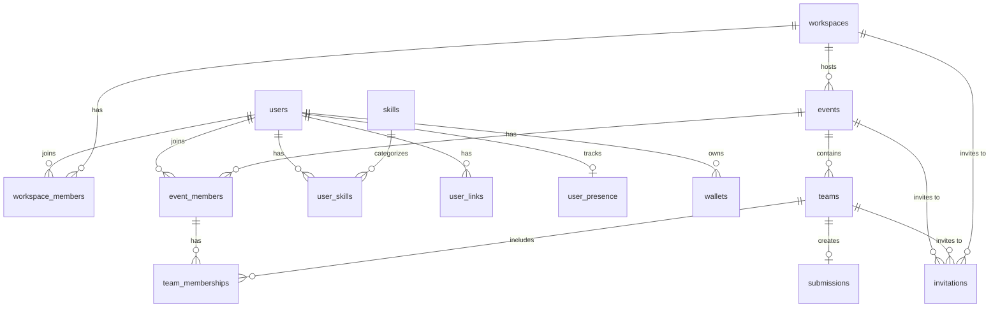

# Stellar Guardian 3.0 - Entity Relationship Diagram

```mermaid
erDiagram
    users ||--o{ workspace_members : "joins"
    users ||--o{ event_members : "joins"
    users ||--o{ user_skills : "has"
    users ||--o{ user_links : "has"
    users ||--o| user_presence : "tracks"
    users ||--o{ wallets : "owns"

    workspaces ||--o{ workspace_members : "has"
    workspaces ||--o{ events : "hosts"
    
    events ||--o{ event_members : "has"
    events ||--o{ teams : "contains"
    
    event_members ||--o{ team_memberships : "has"
    teams ||--o{ team_memberships : "includes"
    
    teams ||--o| submissions : "creates"
    
    events ||--o{ invitations : "invites to"
    teams ||--o{ invitations : "invites to"
    workspaces ||--o{ invitations : "invites to"

    skills ||--o{ user_skills : "categorizes"
```
