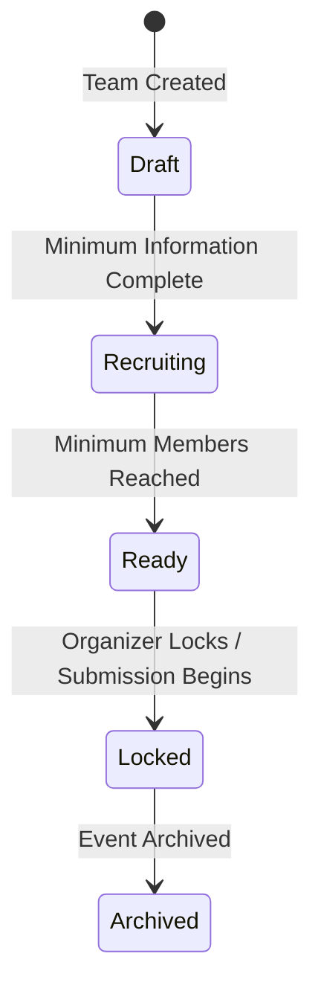

# Module 3: Teams Architecture

## Executive Summary
Module 3 is the core collaboration engine for Stellar Guardian. It transforms the platform from a simple participant registry into a rich, collaborative workspace where Event Members form Teams, manage resources, and prepare their project submissions. Teams are treated as dynamic workspaces (akin to a GitHub repository or Notion space) rather than simple database rows. This module introduces structured matchmaking, role requirements, and rigorous business rules to govern team lifecycles, composition, and state transitions.

## Domain Model
- **Team**: The central collaborative entity within an Event. Represents a group of Event Members working toward a Submission.
- **Team Membership**: The junction between an Event Member and a Team. Roles are explicitly scoped to the team (e.g., Captain, Member). Includes a lifecycle status (Active, Left, etc.). Note: Captaincy is derived from this table.
- **Team Join Request**: An application from an Event Member to join a Team. (User -> Team).
- **Team Invitation**: An invitation sent by a Team to a User. (Team -> User).
- **Team Roles Needed**: A matchmaking entity defining the open positions on a Team (e.g., "Backend Rust Developer"), including experience levels and requirement flags.
- **Tags / Team Tags**: Categorized tags (e.g., Blockchain, AI) providing metadata for a Team in the matchmaking marketplace.
- **Team Match Preferences**: Team-specific preferences for matchmaking (timezones, availability, experience level). Related array attributes are relational.

## Database Schema (Missing Tables to Add)
The following tables will be created to support the new Team domain:

*Note on Soft Deletes*: Every soft-deletable table contains `deleted_at`, `deleted_by`, and `delete_reason` to support future audits.

- `teams`: (id, event_id, name, slug, tagline, description, logo_url, banner_url, status, visibility, looking_for_members, min_members, max_members, created_by, created_at, updated_at, archived_at, deleted_at, deleted_by, delete_reason)
- `team_memberships`: (id, team_id, event_member_id, role, status, joined_at, left_at)
- `team_join_requests`: (id, team_id, event_member_id, message, status, expires_at, review_reason, reviewed_by, reviewed_at, created_at, deleted_at, deleted_by, delete_reason)
- `team_invitations`: (id, team_id, event_member_id, invited_by, message, status, expires_at, created_at, deleted_at, deleted_by, delete_reason)
- `team_roles_needed`: (id, team_id, role_name, skill_id, quantity, is_filled, priority, experience_level, is_required, deleted_at, deleted_by, delete_reason)
- `tags`: (id, name, category)
- `team_tags`: (team_id, tag_id)
- `team_activity`: (id, team_id, actor_id, entity_type, entity_id, action, previous_value JSONB, new_value JSONB, source, ip_address, user_agent, correlation_id, request_id, created_at)
- `team_settings`: (team_id, join_policy, default_visibility, submission_policy)
- `team_feature_flags`: (team_id, flag, enabled) - For boolean toggles without migrations (e.g., allow_member_leave, auto_accept, allow_public_join).
- `team_files`: (id, team_id, storage_path, mime_type, uploaded_by, checksum, visibility, name, size, version, is_latest, status, created_at, deleted_at, deleted_by, delete_reason)
- `team_links`: (id, team_id, type, url, sort_order, verified, verified_at, deleted_at, deleted_by, delete_reason)
- `team_match_preferences`: (team_id, preferred_timezone, experience_level, availability)
- `team_preferred_roles`: (team_id, role)
- `team_preferred_skills`: (team_id, skill_id)
- `team_preferred_languages`: (team_id, language_code)

### Future Concepts (Reserved, Not Implemented in V1)
- `team_match_scores`: (team_id, event_member_id, score, reasons, calculated_at) - To cache AI/heuristic recommendations.

### SQL Views
- `team_metrics_view`: Aggregates dynamic metrics (current_members, pending_requests, pending_invites, completeness_score, submission_status) to ensure fast dashboard load times.
- `team_current_captain_view`: Retrieves the current active Captain for a team based on `team_memberships`.

### Required Indexes
- `teams`: `(event_id)`, `(slug)`, `(status)`, `(visibility)`
- `team_memberships`: `(team_id)`, `(event_member_id)`, `(status)`
- `team_join_requests`: `(team_id, status)`
- `team_roles_needed`: `(team_id)`
- `team_invitations`: `(event_member_id, status)`

### Standardized Enums
- **Team Visibility**: `Public` (everyone), `Workspace` (workspace members only), `Private` (invited members only).
- **Team Links**: `GitHub`, `Figma`, `Devpost`, `Documentation`, `Demo`, `Video`, `Slides`, `Website`.
- **Team Activity**: `TEAM_CREATED`, `MEMBER_JOINED`, `MEMBER_LEFT`, `CAPTAIN_CHANGED`, `ROLE_UPDATED`, `SUBMISSION_STARTED`, `SUBMISSION_COMPLETED`, `TEAM_ARCHIVED`, `JOIN_REQUEST_CREATED`, `JOIN_REQUEST_APPROVED`, `JOIN_REQUEST_REJECTED`, `INVITATION_SENT`, `INVITATION_ACCEPTED`, `INVITATION_DECLINED`, `FILE_UPLOADED`, `LINK_ADDED`, `SETTINGS_UPDATED`.
- **Membership Status**: `Active`, `Invited`, `Pending`, `Left`, `Removed`, `Transferred`.
- **Experience Level**: `Junior`, `Mid`, `Senior`.
- **File Status**: `Uploading`, `Uploaded`, `Scanning`, `Ready`, `Failed`, `Deleted`.
- **Activity Source**: `API`, `WEB`, `SYSTEM`, `CRON`, `ADMIN`.

## State Machine
The `teams.status` field will transition through the following lifecycle. Note that `Locked -> Recruiting` is disallowed unless explicitly unlocked by an Organizer.

1. **Draft**: Team created but not publicly listed. Still setting up profile/needs.
2. **Recruiting**: Team is publicly listed in the marketplace and accepting members.
3. **Ready**: Team is fully formed and working on their submission. No longer actively recruiting.
4. **Locked**: Submission has begun or the event deadline has passed. Roster changes are frozen.
5. **Archived**: Event has concluded or team was disbanded.

## Business Rules Architecture

Business rules are split into two layers to ensure system integrity while maintaining flexibility:

### Database (Hard Invariants)
Constraints and triggers enforce rules that must never be violated under any circumstance.
- Prevent duplicate active team memberships.
- Prevent membership changes when the team is `Locked`.
- Enforce foreign keys and unique constraints.
- Ensure `max_members >= min_members`.

### Domain Service / API Layer (Business Workflows)
Complex logic is handled at the API layer.
- Ensure team is not full before accepting a join request (return user-friendly error).
- Captain approval vs Auto-accept logic.
- Matchmaking and compatibility score generation.
- Dispatching notifications and logging activity via event sourcing (`team_activity`).
- Captain cannot leave without transferring ownership (orchestrated transaction).
- Cannot delete team if a submission exists.
- Cannot archive team if judging has started.

## API Contracts & Domain Services

### Service Boundaries & Responsibilities

**TeamService**
- **Owns**: Create, Update, Archive, Restore, Transfer Captain, Calculate Completeness, Lock, Unlock.
- **Does Not Own**: Invitations, Join Requests, Matchmaking, Notifications.

**JoinRequestService**
- **Owns**: Submit, Withdraw, Approve, Reject, Expire.

**InvitationService**
- **Owns**: Invite, Cancel, Accept, Decline, Expire.

**MatchmakingService**
- **Owns**: Candidate search, Compatibility scoring, Recommendation ranking, Team suggestions, Member suggestions.

**ActivityService**
- **Owns**: Audit log creation, Timeline generation, Feed aggregation.

### Domain Events (Future Event Bus)
Services will emit domain events to decouple logic rather than calling each other directly. These events become the platform-wide language.

**Team Events**:
- `TeamCreated`, `TeamUpdated`, `TeamArchived`, `TeamRestored`

**Membership Events**:
- `MemberJoined`, `MemberLeft`, `CaptainTransferred`, `RoleChanged`

**Join Request Events**:
- `JoinRequestCreated`, `JoinRequestApproved`, `JoinRequestRejected`, `JoinRequestExpired`

**Invitation Events**:
- `InvitationSent`, `InvitationAccepted`, `InvitationDeclined`, `InvitationCancelled`

**Submission Events**:
- `SubmissionStarted`, `SubmissionCompleted`

**Event Bus Flow (Future)**:
`Domain Events` -> `Activity Handler` -> `Notification Handler` -> `Email / Discord / Activity Feed / Analytics`

## RBAC Matrix

| Action | Workspace Admin/Org | Team Captain | Team Member | Non-Member Participant |
| :--- | :---: | :---: | :---: | :---: |
| Create Team | ✅ | ❌ | ❌ | ✅ |
| Update Team Profile | ✅ | ✅ | ❌ | ❌ |
| Invite Members | ✅ | ✅ | ❌ | ❌ |
| Process Join Requests | ✅ | ✅ | ❌ | ❌ |
| Remove Members | ✅ | ✅ | ❌ | ❌ |
| Transfer Captain | ✅ | ✅ | ❌ | ❌ |
| Disband Team | ✅ | ✅ | ❌ | ❌ |
| Submit Project | ✅ | ✅ | ❌ | ❌ |
| View Team Files | ✅ | ✅ | ✅ | ❌ |

## UI Architecture
The Team view will be modeled as a rich collaborative Workspace rather than a simple CRUD list:
1. **Hero**: Banner, Logo, Name, Status, Health.
2. **Matchmaking Board**: Highlighting "Roles Needed" based on missing skills.
3. **Members**: Roster management with presence and roles.
4. **Activity Feed**: Real-time log of team actions (joins, file uploads, status changes).
5. **Milestones / Tasks**: Kanban or list view of team objectives.
6. **Submission Progress**: Checklist of required assets before lock.
7. **Resources**: Links and file attachments relevant to the team.

## Acceptance Criteria & Definition of Done
- [ ] Database schema frozen
- [ ] PostgreSQL enums frozen
- [ ] Foreign keys validated
- [ ] RLS policies implemented
- [ ] Domain services scaffolded
- [ ] API contracts documented
- [ ] TypeScript types generated
- [ ] Views validated
- [ ] Business rules documented
- [ ] State machine documented
- [ ] Matchmaking engine documented
- [ ] Migration passes db reset
- [ ] npm run build passes
- [ ] npm run typecheck passes
- [ ] Seed data loads successfully
- [ ] No duplicate sources of truth
- [ ] No circular service dependencies
- [ ] Compliance report completed
