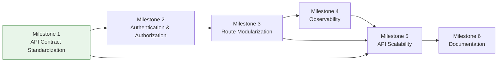

# Backend Modernization Roadmap

**Project:** Stellar Guardian 3.0  
**Document Type:** Planning Artifact (no code implementations)  
**Created:** 2025  
**Status:** Draft

---

## Executive Summary

Following the successful completion of the critical stabilization phase — input validation across all write endpoints — a consistency audit of the Stellar Guardian backend revealed systemic issues across six domains requiring structured remediation:

1. **Response Format** — 29 endpoints return flat JSON responses without a standardized envelope, creating inconsistent shapes for frontend consumers.
2. **Error Handling** — Approximately 20 endpoints use a legacy `{ error: "string" }` pattern instead of a structured error envelope with codes, messages, and optional details.
3. **Authentication Middleware** — The codebase maintains two competing auth patterns: a legacy `authenticateToken` function and a modern `authenticate` factory, creating confusion and inconsistent protection across routes.
4. **Logging & Observability** — Structured logging exists on only 4 endpoints, with no request ID propagation, no application metrics, and no health check endpoints.
5. **Pagination** — Only the notifications endpoint implements offset-based pagination; all other list endpoints return unbounded arrays.
6. **Route Organization** — The monolithic `server.ts` file exceeds 660 lines with inline handlers, while only 3 of approximately 11 domain modules have been extracted into dedicated route files.

This roadmap organizes all remaining remediation work into six sequenced milestones, each with scope definition, impact assessment, risk classification, effort estimation, dependency mapping, and recommended execution order. The milestones form a critical path where each phase builds upon the deliverables of its predecessors, with one identified opportunity for partial parallel execution.

This document is a planning artifact only. It contains zero code implementations, zero file modifications outside this document, and zero database migrations. When a milestone is approved for implementation, a dedicated implementation spec will be created tracing each task back to this roadmap.

---

## Milestone 1: API Contract Standardization

### Execution Order: 1

### Scope

Wrap all 29 flat-response endpoints in a `{ data: { ... } }` success envelope, providing frontend consumers a predictable top-level response structure. Migrate approximately 20 endpoints from the legacy `{ error: "string" }` pattern to a structured error envelope: `{ error: { code: string, message: string, details?: object } }`. Audit HTTP status codes across all modified endpoints to ensure REST semantic correctness — 201 for resource creation, 204 for deletion with no body, 404 for missing resources, 409 for conflicts, and 422 for validation failures. This milestone establishes the response contract foundation that all subsequent milestones depend upon.

### Expected Impact

**High** — All frontend API consumers are affected. Every client-side service layer, error handler, and response parser must be updated to expect the new envelope shapes. Response format changes propagate to all integration points including the web application, any mobile clients, and third-party integrations consuming the API.

### Implementation Risk

**Medium** — Response shape changes are breaking changes for existing consumers. However, the risk is manageable through coordinated frontend-backend deployment. The breaking changes affect response format only (not business logic), enabling a systematic migration approach where endpoints can be updated in batches with coordinated frontend updates. No authentication or authorization logic is modified, limiting the blast radius to data shape parsing.

### Risk Mitigation

- Migrate endpoints in small batches (5–8 per iteration) with corresponding frontend updates
- Maintain a migration tracking checklist to ensure no endpoint is missed
- Run full regression test suite after each batch
- Coordinate deployment windows with frontend team to minimize consumer disruption

### Estimated Effort

**M** (2–3 sprints) — Based on 29 success-response endpoints requiring envelope wrapping, approximately 20 error-response endpoints requiring structured error migration, and HTTP status code auditing across all 49 affected endpoints. Each endpoint requires modification, corresponding test updates, and regression verification.

### Dependencies

None — This milestone has no upstream milestone dependencies and is recommended as the first phase of execution. It establishes the response contract foundation required by all subsequent milestones.

### Completion Criteria

1. All 29 success-response endpoints return the `{ data: { ... } }` envelope format
2. All approximately 20 error-response endpoints return the structured error envelope: `{ error: { code: string, message: string, details?: object } }`
3. No endpoint returns an HTTP status code inconsistent with its operation semantics (e.g., no 200 for resource creation, no 200 for deletion with empty body)
4. Full regression test suite passes with updated response shape assertions
5. Frontend consumers successfully parse all modified response formats without runtime errors

---

## Milestone 2: Authentication & Authorization

### Execution Order: 2

### Scope

Remove the legacy `authenticateToken` middleware and migrate all protected endpoints to the modern `authenticate` factory from `server/middleware/auth.ts`. Consolidate `requireHost` into a composable authorization layer where authorization checks are individual middleware functions chainable after `authenticate` in any order. Establish a shared middleware chain pattern applied to every protected route: authenticate → authorize → validate → handler. This fixed ordering ensures authentication is verified first, authorization permissions are checked second, request payload is validated third, and the business logic handler executes last. Approximately 30 protected endpoints require migration to the unified pattern. The composable design allows new authorization middleware (e.g., `requireAdmin`, `requireTeamMember`) to be introduced without modifying existing chains.

### Expected Impact

**High** — Authentication changes affect every protected endpoint in the application (~30 protected endpoints). All route definitions must be updated to use the new middleware chain pattern. Frontend consumers relying on specific auth error response shapes will receive standardized error envelopes from Milestone 1. Any third-party integrations authenticating against the API are also affected.

### Implementation Risk

**High** — Incorrect migration could lock out legitimate users or bypass authorization checks, creating security vulnerabilities. The dual-pattern state during migration introduces risk of inconsistent protection if endpoints are partially migrated. Authorization bypass is a critical security concern that requires careful verification at every step.

### Risk Mitigation

- Migrate one route group at a time (e.g., events first, then invitations, then submissions) with automated test verification before advancing to the next group
- Run full integration test suite after each route group migration to verify no auth regression
- Maintain the legacy `authenticateToken` function until all endpoints are confirmed migrated and passing tests
- If an endpoint's existing integration tests fail after migration, revert that endpoint to its pre-migration state until the failure is resolved

### Rollback Strategy

If integration tests fail for any migrated endpoint, immediately revert that endpoint to its pre-migration state. The legacy `authenticateToken` remains available as a fallback until all migrations are verified. No route group advances to production until its full test suite passes with the new middleware chain.

### Estimated Effort

**M** (2–3 sprints) — Based on approximately 30 protected endpoints requiring middleware chain migration, composable authorization layer design, and per-route-group test verification cycles. The sequential migration approach with verification gates adds overhead but reduces risk.

### Dependencies

- **Milestone 1: API Contract Standardization** — Consistent error envelope format (`{ error: { code, message, details? } }`) must be in place before auth migration, as authentication and authorization failures must return standardized error responses.

### Completion Criteria

1. Zero remaining references to the legacy `authenticateToken` function in the codebase
2. All ~30 protected endpoints use the `authenticate` middleware from `server/middleware/auth.ts`
3. All host-only endpoints use the `requireHost` authorization middleware chained after `authenticate`
4. Every protected route follows the shared middleware chain pattern: authenticate → authorize → validate → handler
5. Full integration test suite passes with no auth-related regressions
6. Auth failure responses use the standardized error envelope from Milestone 1

---

## Milestone 3: Route Modularization

### Execution Order: 3

### Scope

Extract all inline route handlers from the 660+ line monolithic server.ts into eight domain-specific route modules: events, invitations, submissions, evaluations, sponsors, milestones, teams, and winners. Resolve the duplicate funding endpoint by consolidating into a single handler within the events route module. Replace all `req: any` parameters with typed Express Request generics, using existing validation schemas for body and params type inference. Each new module follows the established pattern from auth.ts, notifications.ts, and stellar.ts — exporting a single Express Router instance with co-located validation schemas. After extraction, server.ts becomes a slim mounting file registering route modules and global middleware.

### Expected Impact

**Medium** — This is internal refactoring with no API contract changes. External consumers (frontend, mobile, integrations) are unaffected since request/response shapes remain identical. The change improves developer experience through better code navigation, domain isolation, and reduced merge conflicts in the monolithic file.

### Implementation Risk

**Medium** — Extraction may introduce subtle bugs from incorrect request/response handling during migration. Splitting inline handlers into separate modules risks losing closure-scoped variables, middleware ordering dependencies, or implicit shared state. The duplicate funding endpoint resolution requires careful validation that no caller depends on the secondary endpoint path.

### Risk Mitigation

- All existing API tests must pass with identical response shapes before and after extraction
- Extract one domain module at a time, running the full test suite between each extraction
- Verify middleware ordering is preserved in each extracted router (authenticate → authorize → validate → handler)
- Confirm no route path conflicts or shadowed endpoints after consolidation
- Review each extracted module for unintended `req: any` remnants before marking complete

### Estimated Effort

**M** (2–3 sprints) — Eight route modules to extract with associated validation schema co-location, duplicate endpoint resolution, and type annotation replacement across all handlers. Each module requires extraction, test verification, and type safety confirmation.

### Dependencies

- **Milestone 1** (API Contract Standardization) — Standardized response format must be established before extraction so that extracted modules use the consistent envelope pattern from the start
- **Milestone 2** (Authentication & Authorization) — Consolidated auth middleware must be in place so that extracted route modules apply the unified `authenticate` → authorize → validate → handler chain rather than mixing legacy and modern patterns

### Completion Criteria

1. All inline route handlers removed from server.ts; only route module mounting and global middleware remain
2. Eight domain route modules exist in server/routes/ (events, invitations, submissions, evaluations, sponsors, milestones, teams, winners), each exporting a single Express Router instance
3. Each route module co-locates its related validation schemas
4. The duplicate funding endpoint is resolved into a single handler within the events module
5. Zero `req: any` parameters remain — all handlers use typed Express Request generics
6. All existing API tests pass with identical response shapes before and after extraction
7. Each extracted module follows the established pattern from auth.ts, notifications.ts, and stellar.ts

---

## Milestone 4: Observability

### Execution Order: 4

### Scope

Add request ID generation and propagation to all handlers via a global middleware that attaches a unique identifier to each incoming request and threads it through the logging context. Expand structured logging from the current 4 instrumented endpoints to all write endpoints (POST, PUT, PATCH, DELETE), capturing operation type, resource affected, actor, and outcome with the correlated request ID. Define application metrics collection covering request latency histograms, error rate counters, and per-endpoint usage counters. Implement a liveness health check endpoint at GET /api/health returning basic process status, and a readiness check endpoint at GET /api/health/ready verifying downstream dependencies (database connectivity). Health endpoints are unauthenticated and excluded from standard request logging to avoid noise.

### Expected Impact

**Medium** — Observability is non-functional infrastructure with no changes to existing request/response contracts or business logic. However, it is critical for production reliability, enabling the team to trace requests across the system, diagnose failures via correlated logs, detect performance regressions through metrics, and verify deployment health via health check endpoints. No frontend consumers are affected.

### Implementation Risk

**Low** — All observability additions are purely additive. Request ID middleware, structured logging expansion, metrics collection, and health check endpoints introduce no behavioral changes to existing functionality. No request/response contracts are modified. No authentication or authorization logic is altered. The global middleware inserts early in the chain and passes through transparently. Existing tests remain valid without modification.

### Risk Mitigation

- Deploy request ID middleware behind a feature flag initially to confirm zero performance regression under load
- Expand structured logging incrementally (one route module per iteration) with log output validation between each expansion
- Health check endpoints are unauthenticated and isolated from business routes, eliminating interaction risk
- Metrics collection is fire-and-forget with no impact on request latency if the metrics backend is unavailable

### Estimated Effort

**S** (single sprint equivalent) — The work is additive and well-scoped: one global middleware for request IDs, structured log statements added to write endpoints across 8 route modules, metrics instrumentation at the middleware layer, and two simple health check endpoints. No existing code requires modification beyond adding log calls. The modular route structure from Milestone 3 provides clean, isolated injection points.

### Dependencies

- **Milestone 3: Route Modularization** — Modular route files provide clean injection points for per-module logging expansion and middleware attachment. Without extracted route modules, instrumenting the monolithic server.ts would require interleaving observability code with business logic, increasing coupling and reducing maintainability.

### Completion Criteria

1. Every incoming request receives a unique request ID generated by global middleware and propagated through the request lifecycle
2. All write endpoints (POST, PUT, PATCH, DELETE) emit structured log entries including request ID, operation type, resource, actor, and outcome
3. Application metrics are collected for request latency (histogram), error rates (counter), and endpoint usage (counter)
4. GET /api/health returns a 200 response confirming process liveness
5. GET /api/health/ready returns a 200 response when all downstream dependencies (database) are reachable, and a 503 when any dependency is unavailable
6. No existing API tests are broken by observability additions
7. Health check endpoints are excluded from authentication middleware and standard request logging

---

## Milestone 5: API Scalability

### Execution Order: 5

### Scope

Extend the offset-based pagination pattern currently implemented only on the notifications endpoint to all list endpoints: events, public events, and any future collection endpoints. Define a standard pagination response shape containing an `items` array and a `meta` object with `page`, `limit`, `total`, and `totalPages` fields. Add query parameter schemas for filtering and sorting per endpoint, enabling consumers to request specific subsets and orderings without custom endpoint proliferation. Establish a default page size of 20 items with a maximum page size of 50 items. If a consumer requests a page size exceeding 50, the system clamps the value to 50 rather than rejecting the request — this prevents unnecessary 400 errors while enforcing reasonable resource bounds. A versioning or migration strategy must be documented for affected consumers transitioning from flat array responses to the paginated envelope.

### Expected Impact

**Medium** — Frontend list components are affected by wrapping previously flat array responses in the paginated response shape. Components currently expecting a raw array from list endpoints must be updated to unwrap items from the `items` field and consume pagination metadata from the `meta` object. Approximately 3–5 list endpoints require coordinated frontend updates.

### Implementation Risk

**Medium** — Adding pagination to existing endpoints changes the response shape from a flat array to a paginated envelope, which is a breaking change for consumers expecting unpaginated arrays. The risk is manageable because the number of affected endpoints is limited (3–5 list endpoints) and a versioning or migration strategy can be applied to provide backwards compatibility during the transition period.

### Risk Mitigation

- Document a versioning or migration strategy for all affected consumers before implementation begins
- Migrate one list endpoint at a time with corresponding frontend component updates
- Page size clamping (to max 50) prevents resource exhaustion without rejecting valid requests
- Run integration tests after each endpoint migration to verify correct pagination metadata
- Provide a transition window where consumers can opt into paginated responses via query parameters before the flat array format is removed

### Estimated Effort

**M** (2–3 sprints) — Based on extending pagination to approximately 3–5 list endpoints, defining per-endpoint filter/sort query parameter schemas, implementing page size clamping logic, and coordinating frontend migration for each affected list component.

### Dependencies

- **Milestone 1** (API Contract Standardization) — The standardized `{ data: { ... } }` envelope format must be established so that paginated responses nest within the existing response contract
- **Milestone 3** (Route Modularization) — Modular route files provide clean, isolated injection points for pagination middleware and per-endpoint query parameter schemas
- **Milestone 4** (Observability) — Request ID propagation and structured logging must be in place so that new paginated endpoints inherit observability instrumentation from the start, maintaining full request traceability across all list operations

### Completion Criteria

1. All list endpoints (events, public events, and any future collection endpoints) return paginated responses with the standard shape: `{ data: { items: [...], meta: { page, limit, total, totalPages } } }`
2. Each paginated endpoint accepts `page` and `limit` query parameters with proper validation
3. Default page size is 20 items when no `limit` parameter is provided
4. Page size values exceeding 50 are clamped to 50 (not rejected)
5. Each list endpoint has a defined query parameter schema for filtering and sorting
6. A versioning or migration strategy is documented for consumers transitioning from flat array responses
7. All existing API tests pass with updated assertions for the paginated response shape
8. Frontend list components correctly consume the paginated envelope format

---

## Milestone 6: Documentation

### Execution Order: 6

### Scope

Generate an OpenAPI 3.x specification from all public routes implemented in prior milestones, covering every endpoint's request parameters, request body schema, and response schema including the standardized envelope format. Set up Swagger UI served at a dedicated documentation path (e.g., /api/docs) for interactive API exploration with try-it-out capability against all documented endpoints. Create at least three architecture diagrams: a system components diagram showing service boundaries and dependencies, a data flow diagram illustrating request lifecycle through middleware layers, and a deployment topology diagram depicting infrastructure and environment layout. The OpenAPI spec must pass schema validation and remain synchronized with the actual route definitions to prevent documentation drift.

### Expected Impact

**Low** for existing functionality — documentation is purely additive with no changes to runtime behavior, request/response contracts, or business logic. **High** for developer onboarding — new team members gain self-service API exploration, visual system understanding, and interactive endpoint testing without reading source code or requiring tribal knowledge.

### Implementation Risk

**Low** — Documentation generation and Swagger UI are purely additive with no runtime impact on existing functionality. No request/response contracts are modified, no middleware chains are altered, and no business logic is touched. The OpenAPI specification is a static artifact served alongside the application, and architecture diagrams are standalone assets with zero coupling to application code.

### Risk Mitigation

- Generate OpenAPI spec programmatically from route definitions and validation schemas to prevent manual drift
- Validate generated spec against the OpenAPI 3.x JSON Schema before deployment to catch structural errors early
- Serve Swagger UI behind a conditional flag in production if documentation exposure is a concern
- Architecture diagrams use vector formats (SVG or Mermaid) for easy maintenance and version control

### Estimated Effort

**S** (single sprint equivalent) — The work is well-scoped and additive: OpenAPI spec generation leverages existing route definitions and Zod validation schemas, Swagger UI setup is a standard middleware integration, and architecture diagrams are finite deliverables (3 diagrams) with well-defined subjects. No existing code requires modification beyond adding the documentation serving middleware.

### Dependencies

- **Milestone 1** (API Contract Standardization) — Standardized response envelopes must be finalized so OpenAPI schemas reflect the actual response contract
- **Milestone 2** (Authentication & Authorization) — Unified auth middleware must be in place so security schemes are documented correctly in the OpenAPI spec
- **Milestone 3** (Route Modularization) — All routes must be extracted into domain modules so the spec generator can discover all public endpoints
- **Milestone 4** (Observability) — Health check endpoints must exist to be included in the API documentation
- **Milestone 5** (API Scalability) — Pagination response shapes and query parameter schemas must be finalized so list endpoint documentation reflects the paginated contract

Documentation reflects the final API state; all prior milestones must be complete before generating authoritative API documentation.

### Completion Criteria

1. The OpenAPI 3.x specification passes schema validation without errors
2. Every public endpoint is documented in the OpenAPI spec including request parameters, request body schema, and response schema
3. Swagger UI is accessible at the dedicated documentation path and renders all documented endpoints
4. Swagger UI provides try-it-out capability for interactive endpoint testing
5. At least 3 architecture diagrams are created: system components, data flow, and deployment topology
6. Each architecture diagram is available in a reviewable image or vector format (SVG, PNG, or Mermaid)
7. The OpenAPI specification is parseable by Swagger UI without rendering errors

---

## Dependency Graph and Execution Sequencing

### Visual Dependency Graph

**Legend:**
- Green node = eligible for parallel execution (no blocking dependencies)
- Arrows indicate "must complete before" relationships
- **Critical Path:** Milestone 1 → 2 → 3 → 4 → 5 → 6

### Dependency Table

| Predecessor | Successor | Gate Condition |
|-------------|-----------|----------------|
| Milestone 1 | Milestone 2 | All 29 endpoints return data envelope and all error responses use structured error format |
| Milestone 1 | Milestone 5 | Envelope format is finalized and all endpoints conform |
| Milestone 2 | Milestone 3 | Zero legacy authenticateToken references, unified auth middleware in place |
| Milestone 3 | Milestone 4 | All 8 domain route modules extracted and registered |
| Milestone 3 | Milestone 5 | Modular route files provide clean implementation points for pagination |
| Milestone 4 | Milestone 5 | Request ID propagation and structured logging in place so paginated endpoints inherit observability |
| Milestone 5 | Milestone 6 | Pagination response shapes and query schemas finalized |
| Milestones 1–5 | Milestone 6 | All prior milestones complete so documentation reflects final API state |

### Critical Path

The critical path through the roadmap is the longest dependency chain that determines the minimum overall timeline:

**Milestone 1 → Milestone 2 → Milestone 3 → Milestone 4 → Milestone 5 → Milestone 6**

Any delay in a milestone on this path directly delays the entire roadmap completion. Milestones on the critical path cannot be parallelized with their immediate predecessors.

### Parallel Execution Opportunities

#### Milestone 1 — Eligible for Parallel Execution

Milestone 1 (API Contract Standardization) has **no blocking dependencies** and can begin immediately. It is the entry point of the roadmap and unblocks both Milestone 2 (via the critical path) and Milestone 5 (via the envelope format dependency).

#### Milestone 4 — Partial Overlap with Milestone 3

Once Milestone 3 route module interfaces are defined (i.e., the 8 domain route modules have their Router structure and file layout established), the following Milestone 4 tasks may begin in parallel with remaining Milestone 3 work:

- **Request ID global middleware** — Can be implemented and tested independently of route handler extraction since it operates at the application level before route matching
- **Health check endpoint scaffolding** — GET /api/health and GET /api/health/ready are standalone endpoints with no dependency on domain route module internals
- **Metrics middleware configuration** — Request latency, error rate, and usage counters attach at the middleware layer and do not depend on individual handler implementation details

These tasks are unblocked once route module interfaces are defined because they attach at the global middleware or standalone route level, not within specific domain handler logic. The remaining Milestone 4 tasks (structured logging expansion per module) must wait until Milestone 3 is fully complete.

---

## Risk and Effort Summary

### Summary Table

| Milestone Name | Execution Order | Impact | Risk | Estimated Effort | Key Dependencies |
|----------------|:-:|:-:|:-:|:-:|---|
| API Contract Standardization | 1 | High | Medium | M | None |
| Authentication & Authorization | 2 | High | High | M | Milestone 1 |
| Route Modularization | 3 | Medium | Medium | M | Milestone 1, Milestone 2 |
| Observability | 4 | Medium | Low | S | Milestone 3 |
| API Scalability | 5 | Medium | Medium | M | Milestone 1, Milestone 3, Milestone 4 |
| Documentation | 6 | Low/High | Low | S | Milestones 1–5 |

### Effort Sizing Definitions

| Size | Definition |
|------|------------|
| S | Completable within a single sprint equivalent |
| M | 2–3 sprint equivalents |
| L | 4–6 sprint equivalents |
| XL | More than 6 sprint equivalents |

### Total Effort Indicator

**2×S, 4×M**

Two milestones at size S (Observability, Documentation) and four milestones at size M (API Contract Standardization, Authentication & Authorization, Route Modularization, API Scalability).

---

## Non-Implementation Constraint

This document contains **zero code implementations**, **zero file modifications** outside the roadmap document itself, and **zero database migrations**. It is a planning artifact only. No executable code, schema changes, or infrastructure modifications are introduced by this roadmap.

This roadmap is the **single authoritative reference** for creating implementation specs for any milestone. It contains the full scope, sequencing, and success criteria for all planned milestones. All implementation planning SHALL trace back to the milestone entries defined herein.

**Implementation Process:** When a milestone is marked as approved for implementation by the project owner, a dedicated implementation spec SHALL be created that traces each implementation task back to a specific milestone entry in this roadmap. The implementation spec must reference the milestone's scope, completion criteria, dependencies, and risk mitigation strategies as defined in this document.

**Rejection Criterion:** Any proposed change that introduces code, schema changes, or file modifications beyond this roadmap document SHALL be rejected before it is merged. This constraint ensures that implementation work proceeds only through properly scoped implementation specs derived from approved milestones, maintaining traceability and preventing premature or uncoordinated code changes.
