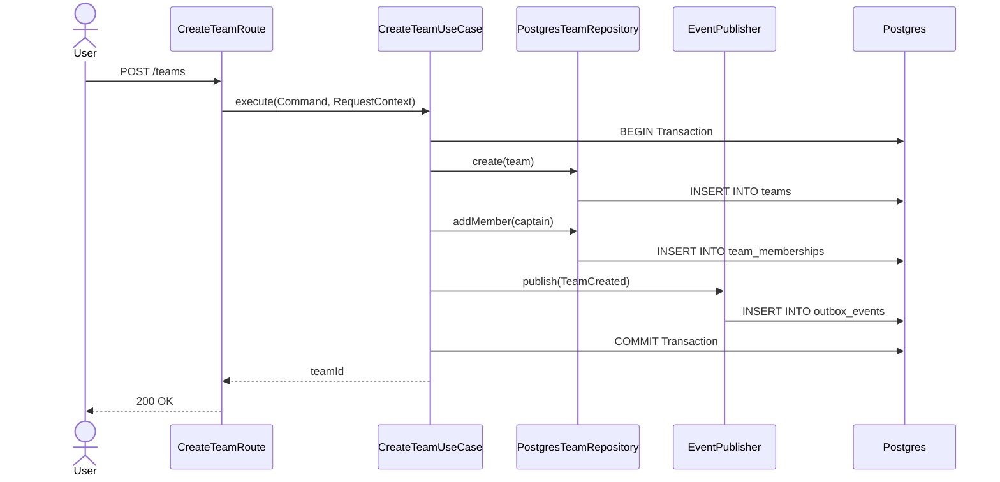

# Team Sequence Diagrams

## Create Team

```mermaid
sequenceDiagram
    actor User
    participant API as CreateTeamRoute
    participant App as CreateTeamUseCase
    participant Repo as PostgresTeamRepository
    participant Event as EventPublisher
    participant DB as Postgres

    User->>API: POST /teams
    API->>App: execute(Command, RequestContext)
    App->>DB: BEGIN Transaction
    App->>Repo: create(team)
    Repo->>DB: INSERT INTO teams
    App->>Repo: addMember(captain)
    Repo->>DB: INSERT INTO team_memberships
    App->>Event: publish(TeamCreated)
    Event->>DB: INSERT INTO outbox_events
    App->>DB: COMMIT Transaction
    App-->>API: teamId
    API-->>User: 200 OK
```
